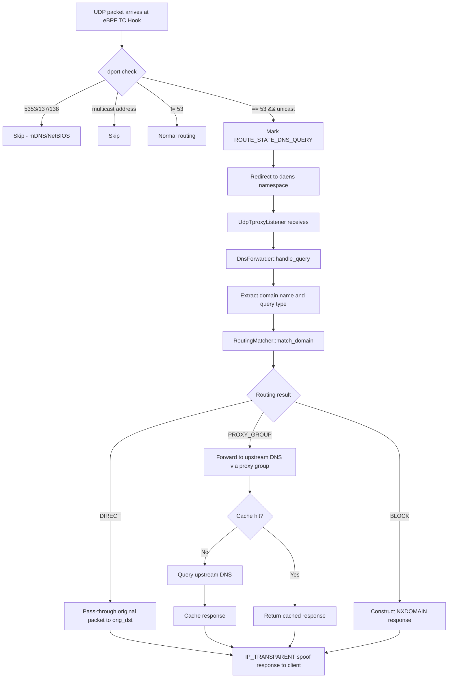

# DNS Forwarder Design

> Bilingual documentation. The Chinese version is available at
> [`dns_forwarder_zh_hans.md`](./dns_forwarder_zh_hans.md).

## 1. Scope

This document describes the DNS forwarder design for dae-rs. Built on top of the
existing eBPF TProxy infrastructure, it implements a UDP DNS transparent
forwarder that provides per-proxy-group DNS query forwarding and caching.

This module implements the DNS transparent proxy functionality and is a new
addition to dae-rs.

## 2. Design Principles

The DNS forwarder adheres to the following core principles:

- **Hijack UDP DNS only** — Only intercept UDP traffic destined for port 53;
  TCP DNS is treated as regular TCP traffic.
- **DNS routing iron rule** — When forwarding DNS, routing decisions are based
  on the **queried domain name**, not the DNS server's IP address.
- **Transparent proxy semantics** — Impersonate the client's original destination
  DNS server (`IP_TRANSPARENT`), transparent to the client.
- **Direct domain pass-through** — No content modifications; the original packet
  is sent to the client's specified original DNS server via a UDP socket marked
  with `SO_MARK=DAE_SOCKET_MARK` (eBPF self-exclusion, preventing the query from
  being re-hijacked into a loop).
- **Proxy domain forwarding per proxy group** — Query Google DNS
  (8.8.8.8 / 2001:4860:4860::8888) through the designated proxy group.
- **DNS cache maintained per proxy group** — Each proxy group maintains an
  independent `DnsCache`, because Google DNS anycast may return different IPs
  from different exit points.
- **TTL used as-is** — Follow the original TTL from upstream DNS responses
  without clamping.
- **No interference with mDNS or NetBIOS** — The eBPF side precisely excludes
  ports 5353 (mDNS), 137/138 (NetBIOS).
- **Remote DNS address not hardcoded** — `upstream_remote` defaults to Google
  DNS, but users can override it in the `dns {}` configuration block; if the
  entire `dns {}` block is absent, the default is used.

## 3. Configuration Design

### 3.1 Global Switch

`forward_dns` is located at the top level of `DaefileConfig` (alongside
`routing` and `outbounds`), typed `bool`, default `true`.

When `forward_dns = false`:
- eBPF does not mark any DNS traffic
- The `dns {}` configuration block is ignored
- All UDP port 53 traffic is routed as regular UDP traffic

### 3.2 dns {} Configuration Block

```hcl
dns {
  # Remote upstream DNS (queried via proxy). Default:
  # ["8.8.8.8:53", "[2001:4860:4860::8888]:53"]
  upstream_remote = ["8.8.8.8:53", "[2001:4860:4860::8888]:53"]

  # Upstream strategy: parallel (concurrent, fastest wins) / sequential (failover)
  upstream_strategy = "parallel"

  # DNS cache entries per proxy group, default 1024
  cache_size_per_group = 1024

  # Single query timeout in milliseconds, default 5000
  query_timeout_ms = 5000
}
```

### 3.3 Configuration Reference

| Field | Type | Default | Description |
|-------|------|---------|-------------|
| `forward_dns` | `bool` | `true` | Global switch for DNS forwarding. When `false`, DNS traffic is left untouched. |
| `upstream_remote` | `Vec<SocketAddr>` | `["8.8.8.8:53", "[2001:4860:4860::8888]:53"]` | List of remote upstream DNS servers (queried via proxy). |
| `upstream_strategy` | `UpstreamStrategy` | `"parallel"` | Upstream selection strategy: `parallel` (concurrent, fastest wins) / `sequential` (failover). |
| `cache_size_per_group` | `usize` | `1024` | Number of cache entries per proxy group. |
| `query_timeout_ms` | `u64` | `5000` | Single query timeout in milliseconds. |

**Note**: The remote DNS address defaults to Google DNS only when the `dns {}`
block is absent or `upstream_remote` is not set. Explicit user configuration
takes precedence.

## 4. Data Flow

### 4.1 Data Flow Overview



### 4.2 Detailed Data Flow

```
When forward_dns == true:

UDP packet arrives at eBPF TC Hook
  ├─ dport ∈ {5353, 137, 138} → Skip (mDNS/NetBIOS)
  ├─ dst is multicast address  → Skip
  ├─ dport != 53               → Normal routing
  └─ dport == 53 && unicast
       ├─ Mark ROUTE_STATE_DNS_QUERY
       └─ Redirect to daens namespace
            │
            ▼
UdpTproxyListener receives (IP_RECVORIGDSTADDR to obtain orig_dst)
            │
            ▼
DnsForwarder::handle_query(packet, orig_dst, client_addr)
  ├─ extract_dns_query_name(packet) → domain, qtype
  ├─ RoutingMatcher::match_domain(domain) → routing result
  │    [Iron rule: based on queried domain, NOT orig_dst]
  └─ Dispatch:
       ├─ DIRECT:
       │   Original packet via UDP socket marked SO_MARK=DAE_SOCKET_MARK (eBPF
       │   self-exclusion, loop prevention) → orig_dst; connect() to orig_dst to
       │   filter unrelated sources, validate txid/QR, then
       │   IP_TRANSPARENT spoof orig_dst → client
       │   ✘ Not cached
       │
       ├─ PROXY_GROUP("name"):
       │   group_caches["name"].get(domain, qtype)
       │   ├─ Hit → IP_TRANSPARENT spoof → client
       │   └─ Miss:
       │       inflight_queries deduplication
       │       Construct Google DNS query
       │       group_dialers["name"] → Google DNS
       │       Wait for response
       │       group_caches["name"].put(domain, qtype, resp)
       │         [TTL = upstream original TTL, no clamping]
       │       IP_TRANSPARENT spoof → client
       │
       └─ BLOCK:
           Construct NXDOMAIN → IP_TRANSPARENT spoof → client


When forward_dns == false:
  All UDP port 53 traffic is routed as regular UDP traffic with no special handling
```

## 5. Core Components

### 5.1 DnsForwarder

`DnsForwarder` is the core component of the DNS forwarder, responsible for
orchestrating the DNS query processing pipeline.

Primary responsibilities:
- Receive DNS query packets from `UdpTproxyListener`
- Extract query domain name and type
- Invoke `RoutingMatcher` to obtain routing decisions
- Dispatch to different processing paths based on routing results
- Manage per-proxy-group cache pools and dialers
- Handle concurrent query deduplication
- Spoof response packets and return them to the client

Key data structures:
- `config: DnsConfig` — DNS forwarder configuration
- `routing_matcher: Arc<RoutingMatcher>` — Routing matcher
- `group_caches: RwLock<HashMap<String, DnsCache>>` — Per-proxy-group DNS cache pool
- `group_dialers: HashMap<String, Arc<GroupDnsDialer>>` — Per-proxy-group remote DNS dialers
- `inflight_queries: DashMap<String, InflightQuery>` — Concurrent query deduplication
- `resp_socket_pool: RespSocketPool` — Response spoofing socket pool

### 5.2 GroupDnsDialer

Each proxy group corresponds to one `GroupDnsDialer`, encapsulating the
outbound dialer and remote DNS addresses for that group.

### 5.3 DnsCache

DNS cache is maintained at proxy group granularity, with one independent
`DnsCache` instance per proxy group.

Cache structure:
- `entries: LruCache<DnsCacheKey, DnsCacheEntry>` — LRU cache entries
- `max_size: usize` — Maximum number of cache entries
- `stats: CacheStats` — Cache statistics

Cache key (`DnsCacheKey`):
- `domain: String` — Normalized lowercase domain name
- `qtype: u16` — Query type (1=A, 28=AAAA)

Cache entry (`DnsCacheEntry`):
- `response_raw: Vec<u8>` — Complete DNS response packet
- `expire_at: Instant` — Expiration time (now + upstream original TTL)

### 5.4 Initialization Flow

The DNS forwarder is initialized in [`lib.rs`](../../control/src/lib.rs):

```
if config.forward_dns {
    let dns_config = config.dns.unwrap_or_default();
    // Build GroupDnsDialer and DnsCache for each proxy group
    for group in &config.outbounds.groups {
        // Build GroupDnsDialer
        // Build DnsCache
    }
    // Create DnsForwarder instance
    // Pass in UdpTproxyListener
    // Set dae_param.dns_hijack_enabled = 1
} else {
    // Set dae_param.dns_hijack_enabled = 0
}
```

## 6. eBPF Side Changes

In [`bpf/kern/tproxy.c`](../../bpf/kern/tproxy.c), the DNS hijack condition
is refined to:

```
static __always_inline bool should_hijack_dns(struct packet_info *pkt) {
    if (!dae_param->dns_hijack_enabled)   // Controlled by forward_dns
        return false;
    if (pkt->l4proto != IPPROTO_UDP)
        return false;
    if (pkt->dport != 53)                 // Exactly 53, excludes 5353/137/138
        return false;
    if (is_multicast_ip(pkt->dst_ip))     // Excludes multicast (mDNS)
        return false;
    return true;
}
```

This ensures TCP port 53 is **not** marked as `ROUTE_STATE_DNS_QUERY`.

## 7. Exclusion List

| Protocol | Port | Affected? | Description |
|----------|------|-----------|-------------|
| Standard DNS (UDP) | 53 unicast | ✅ Hijacked | Handled by DNS forwarder |
| mDNS | 5353 | ❌ Passed through | Routed as regular UDP |
| LLMNR | 5355 | ❌ Passed through | Routed as regular UDP |
| NetBIOS-NS | 137 | ❌ Passed through | Routed as regular UDP |
| NetBIOS-DGM | 138 | ❌ Passed through | Routed as regular UDP |
| DNS (TCP) | 53 | ❌ Routed as regular TCP | No special handling |

## 8. File List

| File | Action | Description |
|------|--------|-------------|
| `docs/design/dns_forwarder_en.md` | **New** | This document |
| `docs/design/dns_forwarder_zh_hans.md` | **New** | Chinese version of this document |
| `control/src/net/dns_forwarder.rs` | **New** | DNS forwarder core implementation |
| `control/src/net/mod.rs` | Modified | Export dns_forwarder module |
| `control/src/config/mod.rs` | Modified | Add DnsConfig struct |
| `control/src/config/parser.rs` | Modified | Parse dns {} configuration block |
| `control/src/lib.rs` | Modified | Initialize DNS forwarder |
| `control/src/net/tproxy.rs` | Modified | Integrate DNS forwarder |
| `bpf/kern/tproxy.c` | Modified | Add DNS hijack logic |
| `config-example/config.daefile` | Modified | Add dns {} configuration example |
