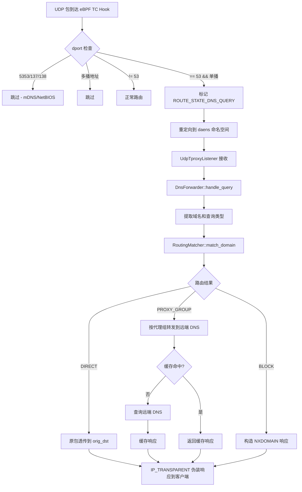

# DNS 转发器设计

> 双语文档。英文版本见 [`dns_forwarder_en.md`](./dns_forwarder_en.md)。

## 1. 范围

本文档描述 dae-rs DNS 转发器的设计方案。基于现有 eBPF TProxy 基础设施，构建 UDP DNS 透明转发器，实现按代理组粒度的 DNS 查询转发与缓存。

本模块对应 DNS 透明代理功能，为 dae-rs 新增模块。

## 2. 设计原则

DNS 转发器遵循以下核心原则：

- **只劫持 UDP DNS**：仅拦截目的端口为 53 的 UDP 流量，TCP DNS 按普通 TCP 流量处理
- **DNS 路由铁律**：转发 DNS 时，路由决策基于**被查询的域名**，而非 DNS 服务器的 IP 地址
- **透明代理语义**：冒充客户端原目标 DNS 服务器（`IP_TRANSPARENT`），客户端无感知
- **直连域名透传**：不做内容修改，原包经带 `SO_MARK=DAE_SOCKET_MARK` 的 UDP socket（eBPF 自排除，防止查询被重新劫持形成环路）发往客户端指定的原始 DNS 服务器
- **代理域名按代理组转发**：经指定代理组查询 Google DNS（8.8.8.8 / 2001:4860:4860::8888）
- **DNS 缓存按代理组粒度维护**：每个代理组一个独立 `DnsCache`，因为 Google DNS anycast 从不同出口可能返回不同 IP
- **TTL 原样使用**：遵循上游 DNS 响应中的原始 TTL，不做钳制
- **不影响 mDNS 与 NetBIOS**：eBPF 侧精确排除 5353（mDNS）、137/138（NetBIOS）端口
- **远端 DNS 地址不硬编码**：`upstream_remote` 默认值为 Google DNS，但用户可在 `dns {}` 配置块中覆盖；若整个 `dns {}` 块不存在则使用默认值

## 3. 配置设计

### 3.1 全局开关

`forward_dns` 位于 `DaefileConfig` 顶层（与 `routing`、`outbounds` 平级），类型 `bool`，默认 `true`。

当 `forward_dns = false` 时：
- eBPF 完全不标记 DNS 流量
- `dns {}` 配置块被忽略
- 所有 UDP port 53 按普通 UDP 流量正常路由

### 3.2 dns {} 配置块

```hcl
dns {
  # 远端上游 DNS（通过代理查询）。默认值：
  # ["8.8.8.8:53", "[2001:4860:4860::8888]:53"]
  upstream_remote = ["8.8.8.8:53", "[2001:4860:4860::8888]:53"]

  # 上游策略：parallel（并发取最快）/ sequential（顺序故障转移）
  upstream_strategy = "parallel"

  # 每个代理组的 DNS 缓存条目数，默认 1024
  cache_size_per_group = 1024

  # 单次查询超时（毫秒），默认 5000
  query_timeout_ms = 5000
}
```

### 3.3 配置项说明

| 配置项 | 类型 | 默认值 | 说明 |
|--------|------|--------|------|
| `forward_dns` | `bool` | `true` | DNS 转发全局开关。`false` 时完全不触碰 DNS 流量 |
| `upstream_remote` | `Vec<SocketAddr>` | `["8.8.8.8:53", "[2001:4860:4860::8888]:53"]` | 远端上游 DNS 服务器列表（通过代理查询） |
| `upstream_strategy` | `UpstreamStrategy` | `"parallel"` | 上游选择策略：`parallel`（并发取最快）/ `sequential`（顺序故障转移） |
| `cache_size_per_group` | `usize` | `1024` | 每个代理组的缓存条目数 |
| `query_timeout_ms` | `u64` | `5000` | 单次查询超时（毫秒） |

**关键**：远端 DNS 地址仅在 `dns {}` 块不存在或 `upstream_remote` 未设置时才使用默认的 Google DNS。用户显式配置时优先使用用户配置。

## 4. 数据流

### 4.1 数据流概览



### 4.2 详细数据流

```
forward_dns == true 时：

UDP 包到达 eBPF TC Hook
  ├─ dport ∈ {5353, 137, 138} → 跳过（mDNS/NetBIOS）
  ├─ dst 为多播地址           → 跳过
  ├─ dport != 53              → 正常路由
  └─ dport == 53 && 单播
       ├─ 标记 ROUTE_STATE_DNS_QUERY
       └─ 重定向到 daens 命名空间
            │
            ▼
UdpTproxyListener 接收（IP_RECVORIGDSTADDR 获取 orig_dst）
            │
            ▼
DnsForwarder::handle_query(packet, orig_dst, client_addr)
  ├─ extract_dns_query_name(packet) → domain, qtype
  ├─ RoutingMatcher::match_domain(domain) → 路由结果
  │    【铁律：基于被查询域名，而非 orig_dst】
  └─ 分派：
       ├─ DIRECT:
       │   原包经带 SO_MARK=DAE_SOCKET_MARK 的 UDP socket（eBPF 自排除，防环路）
       │   → orig_dst；connect() 到 orig_dst 过滤无关来源，校验 txid/QR 后
       │   经 IP_TRANSPARENT 伪装 orig_dst → 客户端
       │   ❌ 不缓存
       │
       ├─ PROXY_GROUP("name"):
       │   group_caches["name"].get(domain, qtype)
       │   ├─ 命中 → IP_TRANSPARENT 伪装 → 客户端
       │   └─ 未命中:
       │       inflight_queries 去重
       │       构造 Google DNS 查询
       │       group_dialers["name"] → Google DNS
       │       等待响应
       │       group_caches["name"].put(domain, qtype, resp)
       │         [TTL = 上游原始 TTL，不钳制]
       │       IP_TRANSPARENT 伪装 → 客户端
       │
       └─ BLOCK:
           构造 NXDOMAIN → IP_TRANSPARENT 伪装 → 客户端


forward_dns == false 时：
  所有 UDP port 53 按普通 UDP 流量正常路由，不做任何特殊处理
```

## 5. 核心组件

### 5.1 DnsForwarder

`DnsForwarder` 是 DNS 转发器的核心组件，负责协调 DNS 查询的处理流程。

主要职责：
- 接收来自 `UdpTproxyListener` 的 DNS 查询包
- 提取查询域名和类型
- 调用 `RoutingMatcher` 获取路由决策
- 根据路由结果分派到不同处理路径
- 管理按代理组维护的缓存和 dialer
- 处理并发查询去重
- 伪装响应包并返回给客户端

关键数据结构：
- `config: DnsConfig` — DNS 转发器配置
- `routing_matcher: Arc<RoutingMatcher>` — 路由匹配器
- `group_caches: RwLock<HashMap<String, DnsCache>>` — 按代理组维护的 DNS 缓存池
- `group_dialers: HashMap<String, Arc<GroupDnsDialer>>` — 按代理组维护的远端 DNS dialer
- `inflight_queries: DashMap<String, InflightQuery>` — 并发查询去重
- `resp_socket_pool: RespSocketPool` — 响应伪装 socket 池

### 5.2 GroupDnsDialer

每个代理组对应一个 `GroupDnsDialer`，封装了该组的出站 dialer 和远端 DNS 地址。

### 5.3 DnsCache

DNS 缓存按代理组粒度维护，每个代理组一个独立的 `DnsCache` 实例。

缓存结构：
- `entries: LruCache<DnsCacheKey, DnsCacheEntry>` — LRU 缓存条目
- `max_size: usize` — 最大缓存条目数
- `stats: CacheStats` — 缓存统计信息

缓存键（`DnsCacheKey`）：
- `domain: String` — 规范化小写域名
- `qtype: u16` — 查询类型（1=A, 28=AAAA）

缓存条目（`DnsCacheEntry`）：
- `response_raw: Vec<u8>` — 完整 DNS 响应包
- `expire_at: Instant` — 过期时间（now + 上游原始 TTL）

### 5.4 初始化流程

DNS 转发器在 `lib.rs` 中初始化：

```
if config.forward_dns {
    let dns_config = config.dns.unwrap_or_default();
    // 为每个代理组构建 GroupDnsDialer 和 DnsCache
    for group in &config.outbounds.groups {
        // 构建 GroupDnsDialer
        // 构建 DnsCache
    }
    // 创建 DnsForwarder 实例
    // 传入 UdpTproxyListener
    // 设置 dae_param.dns_hijack_enabled = 1
} else {
    // 设置 dae_param.dns_hijack_enabled = 0
}
```

## 6. eBPF 侧改动

在 `bpf/kern/tproxy.c` 中，DNS 劫持条件精确化为：

```
static __always_inline bool should_hijack_dns(struct packet_info *pkt) {
    if (!dae_param->dns_hijack_enabled)   // 由 forward_dns 控制
        return false;
    if (pkt->l4proto != IPPROTO_UDP)
        return false;
    if (pkt->dport != 53)                 // 精确 53，排除 5353/137/138
        return false;
    if (is_multicast_ip(pkt->dst_ip))     // 排除多播 (mDNS)
        return false;
    return true;
}
```

确保 TCP port 53 不被标记为 `ROUTE_STATE_DNS_QUERY`。

## 7. 排除清单

| 协议 | 端口 | 受影响？ | 说明 |
|------|------|----------|------|
| 标准 DNS (UDP) | 53 单播 | ✅ 劫持 | DNS 转发器处理 |
| mDNS | 5353 | ❌ 放行 | 按普通 UDP 路由 |
| LLMNR | 5355 | ❌ 放行 | 按普通 UDP 路由 |
| NetBIOS-NS | 137 | ❌ 放行 | 按普通 UDP 路由 |
| NetBIOS-DGM | 138 | ❌ 放行 | 按普通 UDP 路由 |
| DNS (TCP) | 53 | ❌ 按普通 TCP 路由 | 不做特殊处理 |

## 8. 文件清单

| 文件 | 操作 | 说明 |
|------|------|------|
| `docs/design/dns_forwarder_zh_hans.md` | **新增** | 本文档 |
| `control/src/net/dns_forwarder.rs` | **新增** | DNS 转发器核心实现 |
| `control/src/net/mod.rs` | 修改 | 导出 dns_forwarder 模块 |
| `control/src/config/mod.rs` | 修改 | 添加 DnsConfig 结构体 |
| `control/src/config/parser.rs` | 修改 | 解析 dns {} 配置块 |
| `control/src/lib.rs` | 修改 | 初始化 DNS 转发器 |
| `control/src/net/tproxy.rs` | 修改 | 集成 DNS 转发器 |
| `bpf/kern/tproxy.c` | 修改 | 添加 DNS 劫持逻辑 |
| `config-example/config.daefile` | 修改 | 添加 dns {} 配置示例 |
