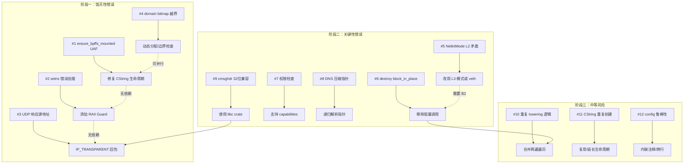
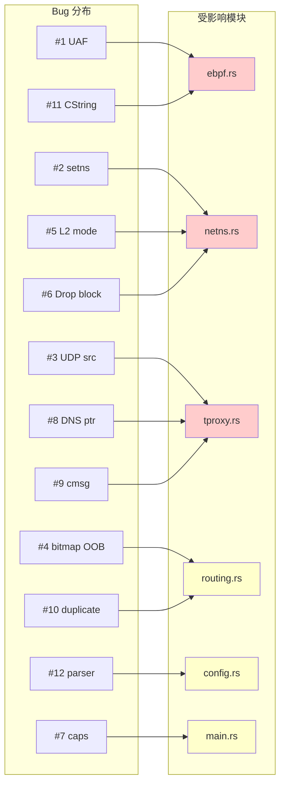

# dae-rs 12 关键错误分阶段修复计划

> 基于源码级分析，针对用户发现的 12 个关键错误制定分阶段修复方案。

---

## 目录

1. [修复阶段总览](#1-修复阶段总览)
2. [第一阶段：毁灭性错误修复（#1-#4）](#2-第一阶段毁灭性错误修复1-4)
3. [第二阶段：关键性错误修复（#5-#9）](#3-第二阶段关键性错误修复5-9)
4. [第三阶段：中等风险修复（#10-#12）](#4-第三阶段中等风险修复10-12)
5. [测试验证计划](#5-测试验证计划)
6. [风险评估与回滚策略](#6-风险评估与回滚策略)
7. [影响分析与架构图](#7-影响分析与架构图)

---

## 1. 修复阶段总览

### 阶段划分逻辑

```
阶段一 (毁灭性) ──→ 阶段二 (关键性) ──→ 阶段三 (中等风险)
   安全性            功能完整性          代码质量
   UAF/内存错误      TProxy 正确性       DRY/鲁棒性
   线程安全           权限模型            注释支持
   数据越界           DNS 完整解析
```

### 依赖关系图



---

## 2. 第一阶段：毁灭性错误修复（#1-#4）

### 🔴 #1 `ensure_bpffs_mounted` 中的 Use-After-Free

| 项目 | 内容 |
|------|------|
| **位置** | [`control/src/ebpf.rs:385-409`](../control/src/ebpf.rs:385) |
| **严重性** | 🔴 毁灭性 — 悬空指针导致未定义行为 |

#### 问题分析

```rust
// 当前代码（问题代码）
unsafe {
    let ret = libc::mount(
        std::ffi::CString::new("bpffs").unwrap().as_ptr(),  // ← 临时 CString
        std::ffi::CString::new("/sys/fs/bpf").unwrap().as_ptr(), // ← 临时 CString
        std::ffi::CString::new("bpf").unwrap().as_ptr(),    // ← 临时 CString
        0,
        std::ptr::null(),
    );
}
```

三个 `CString::new(...)` 创建临时值，在完整表达式结束后立即 `drop`。
`as_ptr()` 指向的内存在 `mount()` 还未返回时就已失效。虽然在这个特定例子中 `mount()` 是同步调用且会在表达式结束前完成，但：
- 编译器可能重排指令或优化导致问题
- 这是 UB（未定义行为），不同 Rust 版本/优化级别下表现不同
- 代码审查和工具（如 Miri）会标记为错误

CString 临时值在完整表达式（full expression）结束时 drop。对于 `unsafe` 代码块中的函数调用参数，CString 临时值会活到函数调用结束，但通常在调用返回后就 drop 了。由于 `mount()` 是同步的，在单一线程场景下**可能**不会立即崩溃，但**仍然是不安全且不符合 Rust 内存安全规范的 UB**。

#### 修复方案

```rust
fn ensure_bpffs_mounted() -> std::io::Result<()> {
    let bpffs_path = std::path::Path::new("/sys/fs/bpf");
    if !bpffs_path.exists() {
        std::fs::create_dir_all(bpffs_path)?;
    }
    // 检查是否已挂载
    let mounts = std::fs::read_to_string("/proc/mounts")?;
    if mounts.lines().any(|line| line.contains("/sys/fs/bpf")) {
        return Ok(());
    }
    // 挂载 bpffs — 绑定 CString 生命周期到局部变量
    let fs_type = std::ffi::CString::new("bpffs")
        .map_err(|e| std::io::Error::new(std::io::ErrorKind::InvalidInput, e))?;
    let target = std::ffi::CString::new("/sys/fs/bpf")
        .map_err(|e| std::io::Error::new(std::io::ErrorKind::InvalidInput, e))?;
    let fstype = std::ffi::CString::new("bpf")
        .map_err(|e| std::io::Error::new(std::io::ErrorKind::InvalidInput, e))?;
    
    unsafe {
        let ret = libc::mount(
            fs_type.as_ptr(),
            target.as_ptr(),
            fstype.as_ptr(),
            0,
            std::ptr::null(),
        );
        if ret != 0 {
            return Err(std::io::Error::last_os_error());
        }
    }
    Ok(())
}
```

#### 修改文件清单
- [`control/src/ebpf.rs`](../control/src/ebpf.rs) — `ensure_bpffs_mounted()` 函数

---

### 🔴 #2 `configure_dae0peer_async` 中 `setns()` 错误处理不当

| 项目 | 内容 |
|------|------|
| **位置** | [`control/src/netns.rs:1078-1087`](../control/src/netns.rs:1078) |
| **严重性** | 🔴 毁灭性 — 线程永久困在代理命名空间 |

#### 问题分析

```rust
// 当前代码
let peer_ifindex = {
    nix::sched::setns(proxy_ns_fd, nix::sched::CloneFlags::CLONE_NEWNET)
        .context("Failed to enter daens to get peer ifindex")?;  // ← ? 如果失败，不会恢复
    let ifindex = get_ifindex_in_ns(&mgr.peer_if)
        .context("Failed to get dae0peer ifindex in daens")?;
    nix::sched::setns(host_ns_fd, nix::sched::CloneFlags::CLONE_NEWNET)
        .context("Failed to return to host netns")?;  // ← 如果此步失败，线程留在 daens
    ifindex
};
```

问题：如果进入 daens 后发生错误（`?` 提前返回），或者返回宿主 NS 失败，调用线程会永久留在代理命名空间中。由于该函数是 `async` 函数，它在 tokio 工作线程上运行，后续所有在此线程上运行的任务都会受到影响。

在 [`control/src/netns.rs:1061-1270`](../control/src/netns.rs:1061) 范围内，多处存在此类模式。

#### 修复方案

使用 RAII Guard 模式确保 setns 的配对操作始终执行：

```rust
/// RAII guard that enters a network namespace and returns on drop.
struct NetnsSwitchGuard {
    saved_ns_fd: OwnedFd,
}

impl NetnsSwitchGuard {
    /// Switch to `target_ns` and save the current namespace for restoration.
    fn new(target_ns: &OwnedFd, current_ns: &OwnedFd) -> Result<Self> {
        // Save current namespace fd
        let saved_ns_fd = current_ns.try_clone()?;
        // Enter target namespace
        nix::sched::setns(target_ns, nix::sched::CloneFlags::CLONE_NEWNET)
            .context("Failed to enter target netns")?;
        Ok(Self { saved_ns_fd })
    }
}

impl Drop for NetnsSwitchGuard {
    fn drop(&mut self) {
        if let Err(e) = nix::sched::setns(&self.saved_ns_fd, nix::sched::CloneFlags::CLONE_NEWNET) {
            // drop 中无法传播错误，只能记录
            tracing::error!("Failed to restore network namespace in guard: {}", e);
        }
    }
}
```

在 `configure_dae0peer_async` 中使用：

```rust
let _guard = NetnsSwitchGuard::new(proxy_ns_fd, host_ns_fd)
    .context("Failed to enter daens")?;
// 此时已在 daens 中，drop _guard 时自动返回
let peer_ifindex = get_ifindex_in_ns(&mgr.peer_if)
    .context("Failed to get dae0peer ifindex in daens")?;
// _guard 在此作用域结束时 drop，无论是否有错误
```

同样检查 [`control/src/netns.rs`](../control/src/netns.rs) 中其他 `setns()` 调用点（如 `join_proxy_ns()`、`join_host_ns()` 等）。

#### 修改文件清单
- [`control/src/netns.rs`](../control/src/netns.rs) — 添加 `NetnsSwitchGuard`，修改所有 `setns()` 调用点

---

### 🔴 #3 UDP TProxy 响应源地址错误

| 项目 | 内容 |
|------|------|
| **位置** | [`control/src/tproxy.rs:1308-1321`](../control/src/tproxy.rs:1308) |
| **严重性** | 🔴 毁灭性 — UDP 透明代理完全失效 |

#### 问题分析

```rust
// SOCKS5 UDP 响应回传路径
if let Some(peer) = peer_addr {
    if let Ok(resp_sock) =
        tokio::net::UdpSocket::bind(if peer.is_ipv4() {
            "0.0.0.0:0"    // ← 没有 IP_TRANSPARENT！
        } else {
            "[::]:0"        // ← 没有 IPV6_TRANSPARENT！
        })
        .await
    {
        if let Err(e) = resp_sock.send_to(payload, peer).await {
            debug!("UDP response send failed: {}", e);
        }
    }
}
```

问题：当通过 SOCKS5 UDP ASSOCIATE 收到响应后，需要将响应数据包回传给原始客户端。但代码创建了一个**普通** UDP socket（没有 `IP_TRANSPARENT`），这会：
1. 内核会使用该 socket 的本地地址（一个随机高位端口）作为源地址
2. 而不是使用原始目标地址（客户端期望的地址）
3. 客户端收到响应时会因为源地址不匹配而丢弃数据包

**注意**：DNS 劫持路径（[`tproxy.rs:1201-1205`](../control/src/tproxy.rs:1201)）使用了 `create_marked_udp_socket()` 正确设置了 IP_TRANSPARENT，所以 DNS 路径不受影响。

#### 修复方案

为 SOCKS5 UDP 响应路径创建带 `IP_TRANSPARENT` 的 socket：

```rust
// 方法一：使用 create_marked_udp_socket 但绑定到原始目标地址（推荐）
if let Some(peer) = peer_addr {
    // 创建一个绑定到原始目标地址的 socket
    let resp_sock = create_marked_udp_socket(&dest).await;  // dest 是原始目标地址
    if let Some(resp_sock) = resp_sock {
        if let Err(e) = resp_sock.send_to(payload, peer).await {
            debug!("UDP response send failed: {}", e);
        }
    }
}
```

或者，创建一个专门的回包函数：

```rust
/// 创建一个用于 UDP 回包的 socket，使用 IP_TRANSPARENT 绑定到目标地址
async fn create_response_socket(source: &SocketAddr) -> Option<tokio::net::UdpSocket> {
    use std::os::unix::io::FromRawFd;
    
    let domain = if source.is_ipv4() {
        libc::AF_INET
    } else {
        libc::AF_INET6
    };
    
    let fd = unsafe { libc::socket(domain, libc::SOCK_DGRAM | libc::SOCK_NONBLOCK, 0) };
    if fd < 0 {
        warn!("create_response_socket: socket() failed: {}", std::io::Error::last_os_error());
        return None;
    }
    
    let one: libc::c_int = 1;
    unsafe {
        if source.is_ipv4() {
            libc::setsockopt(fd, libc::SOL_IP, libc::IP_TRANSPARENT, &one as *const _ as *const libc::c_void, std::mem::size_of::<libc::c_int>() as u32);
        } else {
            libc::setsockopt(fd, libc::SOL_IPV6, IPV6_TRANSPARENT, &one as *const _ as *const libc::c_void, std::mem::size_of::<libc::c_int>() as u32);
        }
    }
    
    let sock_addr = socket2::SockAddr::from(*source);
    let bind_ret = unsafe {
        libc::bind(fd, sock_addr.as_ptr() as *const libc::sockaddr, sock_addr.len())
    };
    if bind_ret < 0 {
        warn!("create_response_socket: bind({}) failed: {}", source, std::io::Error::last_os_error());
        unsafe { libc::close(fd) };
        return None;
    }
    
    let std_socket = unsafe { std::net::UdpSocket::from_raw_fd(fd) };
    match tokio::net::UdpSocket::from_std(std_socket) {
        Ok(s) => Some(s),
        Err(e) => {
            warn!("create_response_socket: from_std failed: {}", e);
            None
        }
    }
}
```

#### 修改文件清单
- [`control/src/tproxy.rs`](../control/src/tproxy.rs) — `run_receive_loop` 中的 SOCKS5 响应路径

---

### 🔴 #4 `build_domain_routing_bitmap` 固定数组越界 Panic

| 项目 | 内容 |
|------|------|
| **位置** | [`control/src/routing.rs:1079-1114`](../control/src/routing.rs:1079) |
| **严重性** | 🔴 毁灭性 — 超过 1024 条 domain 规则导致栈溢出/panic |

#### 问题分析

```rust
// MAX_MATCH_SET_LEN = 1024
pub const MAX_MATCH_SET_LEN: usize = 32 * 32; // 1024

pub fn build_domain_routing_bitmap(
    domain: &str,
    domain_sets: &[Vec<String>],
) -> [u32; MAX_MATCH_SET_LEN / 32] {  // ← [u32; 32], 固定 1024 位
    let mut bitmap = [0u32; MAX_MATCH_SET_LEN / 32];
    // ...
    for (rule_idx, patterns) in domain_sets.iter().enumerate() {
        // rule_idx >= 1024 时：
        bitmap[rule_idx / 32] |= 1 << (rule_idx % 32);  // ← PANIC: 索引越界！
    }
}
```

当 `domain_sets` 中的元素数量超过 `MAX_MATCH_SET_LEN`（1024）时，`rule_idx / 32` >= 32，访问 `bitmap[32+]` 会导致 panic。

#### 修复方案

```rust
/// 构建域路由位图，带边界保护
pub fn build_domain_routing_bitmap(
    domain: &str,
    domain_sets: &[Vec<String>],
) -> Box<[u32]> {   // ← 改为动态大小
    let max_rules = domain_sets.len();
    let array_size = (max_rules + 31) / 32;  // 向上取整
    let mut bitmap = vec![0u32; array_size.max(1)].into_boxed_slice();
    let domain_lower = domain.to_lowercase();
    
    for (rule_idx, patterns) in domain_sets.iter().enumerate() {
        // 安全检查：如果超出了预期范围，记录警告并跳过
        if rule_idx / 32 >= bitmap.len() {
            warn!("Domain routing bitmap overflow at rule index {}", rule_idx);
            break;
        }
        for pattern in patterns {
            // ... 原有匹配逻辑不变 ...
            if matched {
                bitmap[rule_idx / 32] |= 1 << (rule_idx % 32);
                break;
            }
        }
    }
    bitmap
}
```

同时，在调用处（[`domain_routing.rs:74`](../control/src/domain_routing.rs:74)）和 eBPF map 写入处（[`ebpf.rs:1991`](../control/src/ebpf.rs:1991)）需要适配新的返回类型。

#### 修改文件清单
- [`control/src/routing.rs`](../control/src/routing.rs) — `build_domain_routing_bitmap()` 函数
- [`control/src/domain_routing.rs`](../control/src/domain_routing.rs) — `add_dns_result()` 调用适配
- [`control/src/ebpf.rs`](../control/src/ebpf.rs) — eBPF map 写入接口适配

---

## 3. 第二阶段：关键性错误修复（#5-#9）

### 🟠 #5 NetkitMode::L2 与架构设计矛盾

| 项目 | 内容 |
|------|------|
| **位置** | [`control/src/netns.rs:609-624`](../control/src/netns.rs:609) |
| **严重性** | 🟠 关键性 — 功能异常 |

#### 问题分析

```rust
if use_netkit {
    debug!("Creating netkit pair (L2 mode) in host NS");
    let netkit_msg = LinkNetkit::new(host_if, peer_if, NetkitMode::L2)
        .scrub(NetkitScrub::None)
        .peer_scrub(NetkitScrub::None)
        .build();
```

`NetkitMode::L2` 表示 netkit 设备在 L2 模式下工作，数据包转发在二层完成。然而：
- dae-rs 的 eBPF 程序在 TC（L3）层挂载
- L2 模式下，netkit 的转发绕过 TC BPF 程序
- 导致流量不会被代理拦截

在**原版 dae** 中，netkit 使用 `L3` 模式以确保 eBPF 程序能处理经过的流量。

#### 修复方案

根据内核版本选择合适的 netkit 模式：

```rust
if use_netkit {
    // 使用 L3 模式以确保数据包经过 eBPF TC 程序
    // L2 模式会绕过 TC BPF，导致透明代理失效
    let mode = if kernel_version.map_or(false, |(maj, min)| maj > 6 || (maj == 6 && min >= 7)) {
        // 内核 >= 6.7: 使用 L3 模式（更高效且兼容 BPF）
        NetkitMode::L3
    } else {
        // 低版本内核 L3 模式可能有问题，使用 veth 作为 fallback
        warn!("Kernel too old for netkit L3 mode, falling back to veth");
        // 使用 veth 替代
        create_veth_pair(...)?;
        return;
    };
    
    let netkit_msg = LinkNetkit::new(host_if, peer_if, mode)
        .scrub(NetkitScrub::None)
        .peer_scrub(NetkitScrub::None)
        .build();
    // ...
}
```

或者，如果 netkit 的稳定性无法保证，统一使用 veth 模式。

#### 修改文件清单
- [`control/src/netns.rs`](../control/src/netns.rs) — `create_netlink()` 函数

---

### 🟠 #6 `destroy()` 在 Drop 中阻塞 tokio 线程池

| 项目 | 内容 |
|------|------|
| **位置** | [`control/src/netns.rs:897-926`](../control/src/netns.rs:897), [`control/src/netns.rs:1021-1024`](../control/src/netns.rs:1021) |
| **严重性** | 🟠 关键性 — 可能在运行时关闭时导致死锁 |

#### 问题分析

```rust
// Drop 实现
impl Drop for NetnsManager {
    fn drop(&mut self) {
        warn!("NetnsManager dropped without explicit destroy(), cleaning up");
        let _ = self.destroy();  // ← 在 Drop 中调用
    }
}

// destroy() 实现
pub fn destroy(&mut self) -> Result<()> {
    // ...
    match tokio::runtime::Handle::try_current() {
        Ok(handle) => {
            let result = tokio::task::block_in_place(|| {
                handle.block_on(async { self.destroy_async().await })  // ← 在 Drop 中阻塞
            });
        }
        // ...
    }
}
```

问题：
1. `block_in_place` 会占用 tokio 工作线程，在 Drop 上下文中可能导致线程池耗尽
2. 如果在 tokio 运行时关闭过程中 Drop，`block_in_place` 和 `try_current()` 的行为不确定
3. 异步操作（删除路由、删除 link）在 Drop 中执行违反了 RAII 原则

#### 修复方案

```rust
/// 销毁 — 保持同步版本但改用 Command 方式（不依赖 tokio）
pub fn destroy(&mut self) -> Result<()> {
    if self.destroyed {
        return Ok(());
    }
    info!("Destroying network namespace and netkit pair");
    
    // 始终使用同步清理，避免依赖 tokio 运行时
    self.destroy_sync_fallback();
    
    // 关闭 netns fd
    self.host_ns_fd.take();
    self.proxy_ns_fd.take();
    self.destroyed = true;
    
    info!("Network namespace and netkit pair destroyed successfully");
    Ok(())
}

// Drop 中仅记录警告，不执行阻塞操作
impl Drop for NetnsManager {
    fn drop(&mut self) {
        if !self.destroyed {
            warn!("NetnsManager dropped without explicit destroy() — resources may leak");
            // 尝试尽力清理，但不阻塞
            self.destroy_sync_fallback_no_block();
            self.host_ns_fd.take();
            self.proxy_ns_fd.take();
        }
    }
}
```

或者，增强 `destroy_sync_fallback()` 使其功能完整：

```rust
fn destroy_sync_fallback(&self) {
    // 使用 ip 命令完整清理
    let _ = Command::new("ip")
        .args(["link", "del", &self.host_if])
        .output();
    let _ = Command::new("ip")
        .args(["link", "del", &self.peer_if])
        .output();
    let _ = Command::new("ip")
        .args(["netns", "del", NS_NAME])
        .output();
    // 清理路由规则
    let _ = Command::new("ip")
        .args(["rule", "del", "fwmark", &format!("{:#x}", self.proxy_mark)])
        .output();
}
```

#### 修改文件清单
- [`control/src/netns.rs`](../control/src/netns.rs) — `destroy()` 和 `Drop` 实现

---

### 🟠 #7 权限检查过于粗暴

| 项目 | 内容 |
|------|------|
| **位置** | [`src/main.rs:101-116`](../src/main.rs:101) |
| **严重性** | 🟠 关键性 — 不支持容器环境 |

#### 问题分析

```rust
fn check_privileges() -> anyhow::Result<()> {
    let uid = nix::unistd::Uid::effective();
    let euid = uid.as_raw();
    
    if !uid.is_root() {
        anyhow::bail!(
            "dae-rs requires root privileges\n\
             eBPF programs and network operations require:\n\
             ་ CAP_NET_ADMIN\n\
             ་ CAP_SYS_ADMIN\n\
             Please run with sudo or as root"
        );
    }
}
```

问题：
- 仅检查 `euid == 0`
- 在容器中，容器可能没有 root 用户但有 CAP_NET_ADMIN + CAP_BPF capabilities
- 在非 root 但具有 capabilities 的环境中拒绝启动

#### 修复方案

```rust
use caps::{CapSet, Capability};

fn check_privileges() -> anyhow::Result<()> {
    let uid = nix::unistd::Uid::effective();
    let euid = uid.as_raw();
    
    if uid.is_root() {
        tracing::info!("Running with root privileges (euid={})", euid);
        return Ok(());
    }
    
    // 非 root 环境下检查 capabilities
    #[cfg(target_os = "linux")]
    {
        let required_caps = [
            Capability::CAP_NET_ADMIN,   // BPF + 网络操作
            Capability::CAP_SYS_ADMIN,   // 命名空间操作
            Capability::CAP_BPF,         // BPF 系统调用（内核 >= 5.8）
            Capability::CAP_NET_RAW,     // 原始 socket
        ];
        
        let mut missing = Vec::new();
        for cap in &required_caps {
            match caps::has_cap(None, CapSet::Effective, *cap) {
                Ok(true) => {}
                Ok(false) => missing.push(format!("{:?}", cap)),
                Err(e) => {
                    tracing::warn!("Failed to check capability {:?}: {}", cap, e);
                    missing.push(format!("{:?} (check failed: {})", cap, e));
                }
            }
        }
        
        if !missing.is_empty() {
            anyhow::bail!(
                "dae-rs requires elevated privileges\n\
                 Missing capabilities: {}\n\
                 Please run with sudo, as root, or grant the required capabilities.\n\
                 Example: sudo setcap cap_net_admin,cap_sys_admin,cap_bpf,cap_net_raw+ep /path/to/dae-rs",
                missing.join(", ")
            );
        }
        
        tracing::info!("Running with sufficient capabilities (euid={})", euid);
        return Ok(());
    }
    
    #[cfg(not(target_os = "linux"))]
    anyhow::bail!("dae-rs is only supported on Linux");
}
```

依赖：在 [`Cargo.toml`](../Cargo.toml) 中添加 `caps = "0.5"` crate。

#### 修改文件清单
- [`src/main.rs`](../src/main.rs) — `check_privileges()` 函数
- [`Cargo.toml`](../Cargo.toml) — 添加 `caps` 依赖

---

### 🟠 #8 DNS 名称提取不支持压缩指针

| 项目 | 内容 |
|------|------|
| **位置** | [`control/src/tproxy.rs:648-679`](../control/src/tproxy.rs:648) |
| **严重性** | 🟠 关键性 — 域名显示不完整 |

#### 问题分析

```rust
pub fn extract_dns_query_name(packet: &[u8]) -> Option<String> {
    // ...
    loop {
        let len = packet[pos] as usize;
        if len == 0 {
            break;
        }
        if len & 0xC0 == 0xC0 {
            // DNS compression pointer — stop  ← 直接停止，不跟随指针
            break;
        }
        // ...
    }
}
```

当遇到 DNS 压缩指针（0xC0 标识，后跟 14 位偏移量）时，代码直接停止解析并返回部分结果。这导致使用域名压缩的 DNS 查询显示为不完整域名。

#### 修复方案

```rust
/// Extract the query name from a DNS packet, following compression pointers.
pub fn extract_dns_query_name(packet: &[u8]) -> Option<String> {
    if packet.len() < 12 {
        return None;
    }
    let mut labels = Vec::new();
    let mut visited = std::collections::HashSet::new();
    let mut pos = 12usize;
    
    loop {
        if pos >= packet.len() {
            return None;
        }
        let len = packet[pos] as usize;
        
        if len == 0 {
            break;  // 根标签，结束
        }
        
        if len & 0xC0 == 0xC0 {
            // DNS 压缩指针：0xC0 + 14 位偏移量
            if pos + 1 >= packet.len() {
                return None;
            }
            let offset = ((len & 0x3F) << 8) | (packet[pos + 1] as usize);
            
            // 循环检测
            if !visited.insert(offset) {
                tracing::warn!("DNS compression pointer cycle detected at offset {}", offset);
                return None;
            }
            
            pos = offset;
            continue;  // 跟随指针后继续解析
        }
        
        // 普通标签
        pos += 1;
        if pos + len > packet.len() {
            return None;
        }
        if let Ok(label) = std::str::from_utf8(&packet[pos..pos + len]) {
            labels.push(label.to_string());
        } else {
            return None;
        }
        pos += len;
    }
    
    if labels.is_empty() {
        None
    } else {
        Some(labels.join("."))
    }
}
```

#### 修改文件清单
- [`control/src/tproxy.rs`](../control/src/tproxy.rs) — `extract_dns_query_name()` 函数

---

### 🟠 #9 `parse_orig_dst_from_cmsg` 的架构假设

| 项目 | 内容 |
|------|------|
| **位置** | [`control/src/tproxy.rs:1439-1502`](../control/src/tproxy.rs:1439) |
| **严重性** | 🟠 关键性 — 32 位平台完全无法工作 |

#### 问题分析

```rust
pub fn parse_orig_dst_from_cmsg(cmsg_data: &[u8]) -> Option<SocketAddr> {
    let mut offset = 0;
    while offset + 16 <= cmsg_data.len() {
        // 硬编码 64 位 cmsghdr 布局：
        // size_t cmsg_len;    // 8 bytes ← 32 位上是 4 bytes！
        // int    cmsg_level;  // 4 bytes
        // int    cmsg_type;   // 4 bytes
        let cmsg_len = u64::from_ne_bytes([...]) as usize;  // ← 32 位崩溃
```

在 32 位系统上，`cmsghdr.cmsg_len` 是 `u32`（4 字节），而不是 `u64`（8 字节）。硬编码 16 字节头部会导致：
1. 读取错误的 `cmsg_len` 值
2. `cmsg_level` 和 `cmsg_type` 读取到错误偏移
3. 完全无法正确解析 cmsg 数据

#### 修复方案

```rust
/// 安全获取 cmsg_len，兼容 32/64 位
fn get_cmsg_len(data: &[u8], offset: usize) -> Option<usize> {
    if cfg!(target_pointer_width = "64") {
        if offset + 8 > data.len() {
            return None;
        }
        Some(u64::from_ne_bytes([
            data[offset], data[offset+1], data[offset+2], data[offset+3],
            data[offset+4], data[offset+5], data[offset+6], data[offset+7],
        ]) as usize)
    } else {
        if offset + 4 > data.len() {
            return None;
        }
        Some(u32::from_ne_bytes([
            data[offset], data[offset+1], data[offset+2], data[offset+3],
        ]) as usize)
    }
}

/// 获取 cmsghdr 头部大小（平台相关）
fn cmsghdr_size() -> usize {
    if cfg!(target_pointer_width = "64") {
        16  // 8 + 4 + 4
    } else {
        12  // 4 + 4 + 4
    }
}
```

或者，更好的方案是使用 `libc` crate 的标准宏：

```rust
pub fn parse_orig_dst_from_cmsg(cmsg_data: &[u8]) -> Option<SocketAddr> {
    use libc::cmsghdr;
    
    let mut offset = 0;
    while offset + std::mem::size_of::<cmsghdr>() <= cmsg_data.len() {
        // 安全地读取 cmsghdr（兼容所有平台）
        let cmsg = unsafe {
            &*(cmsg_data[offset..].as_ptr() as *const cmsghdr)
        };
        
        let cmsg_level = cmsg.cmsg_level;
        let cmsg_type = cmsg.cmsg_type;
        let cmsg_len = cmsg.cmsg_len as usize;
        
        let data_offset = offset + cmsghdr_size();
        let data_len = cmsg_len - cmsghdr_size();
        // ...
    }
}
```

**推荐方案**：使用 [`libc`](https://docs.rs/libc) crate 提供的 `cmsghdr` 结构体和 `CMSG_FIRSTHDR`/`CMSG_NXTHDR` 宏来遍历 cmsg。

#### 修改文件清单
- [`control/src/tproxy.rs`](../control/src/tproxy.rs) — `parse_orig_dst_from_cmsg()` 函数

---

## 4. 第三阶段：中等风险修复（#10-#12）

### 🟡 #10 路由编译重复逻辑

| 项目 | 内容 |
|------|------|
| **位置** | [`control/src/routing.rs:1217-1293`](../control/src/routing.rs:1217) 和 [`control/src/routing.rs:1690-1730`](../control/src/routing.rs:1690) |
| **严重性** | 🟡 中等 |

#### 问题分析

`compile_rules()` 函数中有两段几乎相同的逻辑：

1. **Pass 1**（[`routing.rs:1217-1293`](../control/src/routing.rs:1217)）：遍历所有规则的 `and_functions`，按函数类型分发，收集 LPM trie 和 domain set 的元数据
2. **Pass 2**（通过 `build_match_set_for_function`，[`routing.rs:1690-1730`](../control/src/routing.rs:1690)）：第二次遍历规则，执行类似的分发逻辑来构建 MatchSet

两段代码都包含：
- `match func.name.as_str()` 分发
- 对 `dip/ip`、`sip/source_ip`、`mac`、`domain` 等类型的处理
- 调用 `find_or_create_lpm_trie()` 等公共函数

#### 修复方案

将两遍遍历合并为单遍遍历，在构建 MatchSet 的同时收集元数据：

```rust
// ── 单遍构建 MatchSet ──
for rule in &program.rules {
    let mut match_sets_for_rule = Vec::new();
    
    for func in &rule.and_functions {
        let match_sets = build_match_set_for_function(
            func, "", &func.raw_params,
            outbound_id, &ov_outbound,
            &mut lpm_tries, &mut lpm_dedup,
            &mut domain_sets, &mut rule_domain_idx,
        )?;
        
        // 同时收集元数据（从 build_match_set_for_function 内部提取）
        collect_lpm_metadata(func, &mut lpm_tries, &mut lpm_dedup, &mut dedup_count);
        collect_domain_metadata(func, &mut domain_sets);
        
        match_sets_for_rule.extend(match_sets);
    }
    // ...
}
```

**重构目标**：消除两个独立的分发 match 块，使用一个统一的 `FunctionProcessor` 特质或枚举调度。

#### 修改文件清单
- [`control/src/routing.rs`](../control/src/routing.rs) — `compile_rules()` 函数重构

---

### 🟡 #11 `ebpf.rs` 中 `CString` 重复创建

| 项目 | 内容 |
|------|------|
| **位置** | [`control/src/ebpf.rs:412-414`](../control/src/ebpf.rs:412), [`control/src/ebpf.rs:482-504`](../control/src/ebpf.rs:482) |
| **严重性** | 🟡 中等 |

#### 问题分析

```rust
// if_nametoindex 中的模式
pub fn if_nametoindex(ifname: &str) -> Result<i32> {
    let cstr = std::ffi::CString::new(ifname)
        .map_err(|e| anyhow::anyhow!("Invalid interface name '{}': {}", ifname, e))?;
    let ifindex = unsafe { libc::if_nametoindex(cstr.as_ptr()) };
    // ...
}
```

虽然 `if_nametoindex` 中已经正确创建了局部 `CString`，但：
1. `kernel_version()` 中 `process::Command::new("uname")` 创建临时 `CString`（通过内部实现）
2. `ensure_bpffs_mounted` 中有 UAF 问题（已在 #1 中修复）
3. 项目中其他 `CString` 使用点应统一审查

#### 修复方案

```rust
/// 辅助宏：在完整表达式作用域内创建 CString 并调用 libc 函数
macro_rules! with_cstring {
    ($str:expr, |$cstr:ident| $body:expr) => {{
        let $cstr = std::ffi::CString::new($str)
            .map_err(|_| std::io::Error::new(std::io::ErrorKind::InvalidInput, "nul byte in string"))?;
        unsafe { $body }
    }};
}

// 使用示例
fn ensure_bpffs_mounted() -> std::io::Result<()> {
    // ...
    unsafe {
        let ret = with_cstring!("bpffs", |fs_type| {
            with_cstring!("/sys/fs/bpf", |target| {
                with_cstring!("bpf", |fstype| {
                    libc::mount(fs_type.as_ptr(), target.as_ptr(), fstype.as_ptr(), 0, std::ptr::null())
                })
            })
        });
        if ret != 0 {
            return Err(std::io::Error::last_os_error());
        }
    }
    Ok(())
}
```

或者统一提取为辅助函数：

```rust
/// 将 Rust &str 转为 CString，用于 libc 调用
fn to_c_string(s: &str) -> std::io::Result<std::ffi::CString> {
    std::ffi::CString::new(s)
        .map_err(|_| std::io::Error::new(std::io::ErrorKind::InvalidInput, "string contains null byte"))
}
```

#### 修改文件清单
- [`control/src/ebpf.rs`](../control/src/ebpf.rs) — 所有 `CString` 使用点的生命周期审查和修复

---

### 🟡 #12 `config.rs` 解析器鲁棒性不足

| 项目 | 内容 |
|------|------|
| **位置** | [`control/src/config.rs:937-944`](../control/src/config.rs:937) |
| **严重性** | 🟡 中等 |

#### 问题分析

```rust
for (line_num, raw_line) in input.lines().enumerate() {
    let line = raw_line.trim();
    // 只检查行首注释
    if line.is_empty() || line.starts_with('#') {
        continue;
    }
```

当前解析器的问题：
1. **不支持行内注释**：`key: value # comment` 中的 `# comment` 不会被移除
2. **不支持跨行字符串**：长值不能跨多行
3. **不支持空值**：`key:` 直接报错

#### 修复方案

```rust
/// 清理行：移除行内注释（只在值部分），保留有效内容
fn clean_line(raw: &str) -> &str {
    let trimmed = raw.trim();
    // 如果是注释行，返回空
    if trimmed.is_empty() || trimmed.starts_with('#') {
        return "";
    }
    // 查找行内注释（# 号，但不在引号内）
    let mut in_quote: Option<char> = None;
    for (i, c) in trimmed.char_indices() {
        match c {
            '\'' | '"' => {
                if in_quote == Some(c) {
                    in_quote = None;
                } else if in_quote.is_none() {
                    in_quote = Some(c);
                }
            }
            '#' if in_quote.is_none() => {
                return trimmed[..i].trim();
            }
            _ => {}
        }
    }
    trimmed
}
```

在解析循环中使用：

```rust
for (line_num, raw_line) in input.lines().enumerate() {
    let line = clean_line(raw_line);
    if line.is_empty() {
        continue;
    }
    // ... 原有解析逻辑不变
}
```

**跨行字符串**的添加需要更复杂的修改，建议：

```rust
// 在处理循环前添加行拼接预处理
fn join_continuation_lines(input: &str) -> String {
    let mut result = String::with_capacity(input.len());
    let mut in_continuation = false;
    
    for line in input.lines() {
        if in_continuation {
            // 移除前导空白后追加到上一行
            let trimmed = line.trim();
            result.push(' ');
            result.push_str(trimmed);
            if !line.ends_with('\\') {
                in_continuation = false;
                result.push('\n');
            }
        } else if line.ends_with('\\') {
            // 下一行继续
            in_continuation = true;
            result.push_str(&line[..line.len() - 1].trim_end());
        } else {
            result.push_str(line);
            result.push('\n');
        }
    }
    result
}
```

#### 修改文件清单
- [`control/src/config.rs`](../control/src/config.rs) — `parse_config_str()` 函数及辅助函数

---

## 5. 测试验证计划

### 5.1 阶段一验证

| 测试项 | 测试方法 | 预期结果 |
|--------|----------|----------|
| [#1] UAF 修复验证 | 运行 `cargo clippy` 和 `cargo miri` 检测 | 无内存安全警告 |
| [#1] BPFFS 挂载 | 在未挂载 bpffs 的系统上启动 | 自动挂载成功 |
| [#2] setns RAII Guard | 注入 setns 错误 | 线程安全返回宿主 NS |
| [#2] 命名空间隔离 | 多次创建/销毁 netns | 无残留命名空间 |
| [#3] UDP TProxy 回包 | 用 UDP 客户端测试 | 响应源地址为原始目标 |
| [#3] UDP SOCKS5  | 通过 SOCKS5 代理 UDP 流量 | 响应正确回传 |
| [#4] 1024+ domain 规则 | 创建 2000 条 domain 规则 | 无 panic，正确截断或警告 |

### 5.2 阶段二验证

| 测试项 | 测试方法 | 预期结果 |
|--------|----------|----------|
| [#5] Netkit L3 模式 | 创建 netkit pair 并检查 | eBPF 程序处理流量 |
| [#5] veth fallback | 低版本内核上运行 | 自动使用 veth |
| [#6] Drop 不阻塞 | 运行时关闭时 Drop | 无死锁，快速返回 |
| [#6] 资源清理 | 多次对象创建/销毁 | 无资源泄漏 |
| [#7] Capabilities 检查 | 容器中非 root 但具有 cap 运行 | 启动成功 |
| [#7] 无权限拒绝 | 普通用户运行 | 清晰错误提示 |
| [#8] DNS 压缩指针 | 发送含压缩指针的 DNS 查询 | 完整域名 |
| [#9] cmsg 解析 | 在 32 位平台测试 | 正确解析原始目标地址 |

### 5.3 阶段三验证

| 测试项 | 测试方法 | 预期结果 |
|--------|----------|----------|
| [#10] 路由编译重构 | 运行现有路由测试 | 输出与重构前一致 |
| [#11] CString 审查 | `grep -r "CString.*as_ptr"` | 无临时 CString |
| [#12] 行内注释 | 配置文件中使用 `#` 注释 | 正确解析 |
| [#12] 跨行字符串 | 配置文件使用 `\` 续行 | 正确拼接 |

### 5.4 回归测试

每个阶段完成后，运行完整的测试套件：

```bash
# 单元测试
cargo test --workspace

# 代码质量检查
cargo clippy --workspace -- -D warnings

# 安全审计
cargo audit     # 如果安装了 cargo-audit

# 编译检查（所有 feature）
cargo build --workspace --all-features
```

---

## 6. 风险评估与回滚策略

### 6.1 风险矩阵

| 风险 | 概率 | 影响 | 缓解措施 |
|------|------|------|----------|
| [#1] 修复引入新 UB | 低 | 高 | 使用 Miri 验证 |
| [#2] RAII Guard panics 在 drop 中 | 低 | 中 | 使用 `std::panic::catch_unwind` |
| [#3] IP_TRANSPARENT socket 创建失败 | 低 | 中 | fallback 到普通 socket + 日志 |
| [#4] 动态分配性能退化 | 低 | 低 | 使用 small vector 优化 |
| [#5] L3 模式内核兼容性 | 中 | 高 | 保持 veth fallback 路径 |
| [#6] 同步清理不完全 | 中 | 中 | 增强 destroy_sync_fallback |
| [#7] `caps` crate 兼容性 | 低 | 低 | 保持 root check 作为 fallback |
| [#8] 压缩指针循环 | 低 | 低 | visited set 防循环 |
| [#9] libc 宏兼容性 | 低 | 低 | 条件编译 fallback |
| [#10] 重构引入语义差异 | 中 | 中 | 添加 property-based testing |
| [#11] 宏展开错误 | 低 | 低 | 单元测试每个宏 |
| [#12] 行内注释破坏值 | 低 | 低 | 仅在值区域处理 `#` |

### 6.2 回滚策略

```
每个修复独立提交 → 回滚粒度 = 单个修复
     ↓
阶段一所有修复经过 Code Review → 合并到 main
     ↓
阶段二基于阶段一的新 main → 同样独立提交
     ↓
阶段三基于阶段二的新 main
```

**回滚脚本示例：**

```bash
# 回滚单个修复
git revert <commit-hash> --no-edit

# 回滚整个阶段
git revert HEAD~N..HEAD --no-edit  # N 为该阶段的提交数

# 紧急回滚（main 分支）
git reset --hard origin/main~1
```

---

## 7. 影响分析与架构图

### 影响域分析



### 文件修改汇总

| 文件 | 修复的 Bug | 修改复杂度 |
|------|-----------|-----------|
| [`control/src/ebpf.rs`](../control/src/ebpf.rs) | #1, #11 | 低 |
| [`control/src/netns.rs`](../control/src/netns.rs) | #2, #5, #6 | 高 |
| [`control/src/tproxy.rs`](../control/src/tproxy.rs) | #3, #8, #9 | 高 |
| [`control/src/routing.rs`](../control/src/routing.rs) | #4, #10 | 中 |
| [`control/src/config.rs`](../control/src/config.rs) | #12 | 中 |
| [`src/main.rs`](../src/main.rs) | #7 | 低 |
| [`Cargo.toml`](../Cargo.toml) | #7 | 低 |
| [`control/src/domain_routing.rs`](../control/src/domain_routing.rs) | #4 | 低 |

### 预计提交结构

```
commit 1: fix(ebpf): 修复 ensure_bpffs_mounted Use-After-Free (#1)
commit 2: fix(netns): 添加 NetnsSwitchGuard RAII Guard 修复 setns 错误处理 (#2)
commit 3: fix(tproxy): 为 UDP SOCKS5 回包添加 IP_TRANSPARENT (#3)
commit 4: fix(routing): build_domain_routing_bitmap 动态分配防止越界 (#4)
commit 5: fix(netns): NetkitMode 改为 L3 模式或 veth fallback (#5)
commit 6: fix(netns): 移除 destroy 中的 block_in_place 阻塞调用 (#6)
commit 7: fix(main): 支持 Linux Capabilities 权限检查 (#7)
commit 8: fix(tproxy): DNS 名称提取支持压缩指针跟随 (#8)
commit 9: fix(tproxy): parse_orig_dst_from_cmsg 架构兼容 (#9)
commit 10: refactor(routing): 合并两遍规则降低逻辑为单遍 (#10)
commit 11: fix(ebpf): 统一 CString 生命周期管理 (#11)
commit 12: feat(config): 支持行内注释和跨行字符串 (#12)
```

---

*此计划文档基于 [`vscode`](command:_dae-rs.project) 项目 [`control/src/`](../control/src/) 和 [`src/main.rs`](../src/main.rs) 的源码阅读分析完成。所有行号引用基于当前工作区文件内容。*
