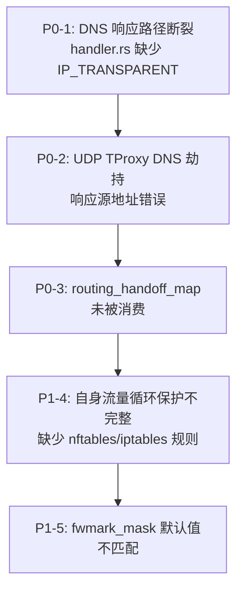
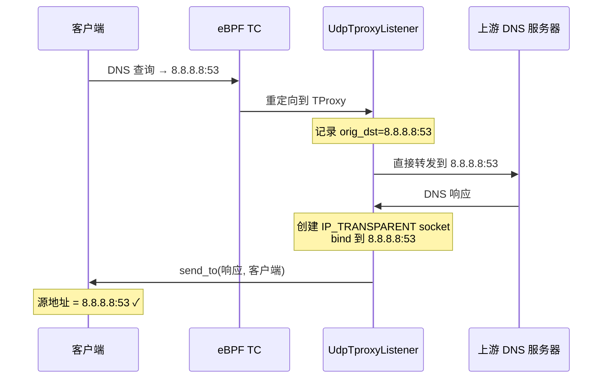
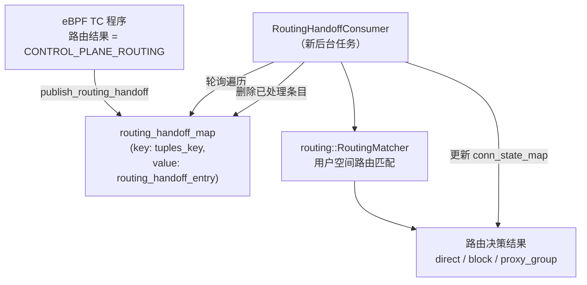
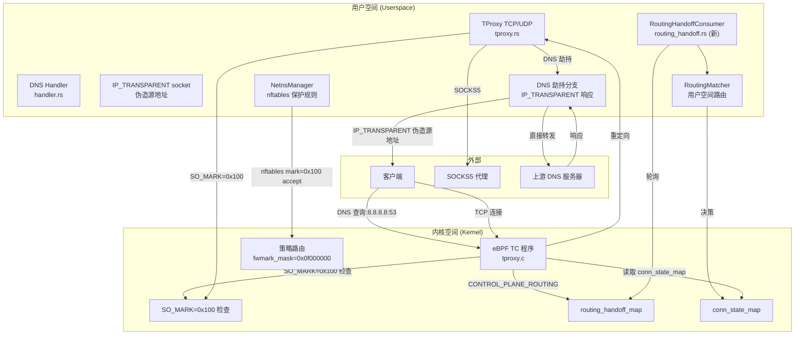

# dae-rs 修复方案

## 概述

本文档基于对 dae-rs 和参考项目 dae 的深入代码分析，提出完整的修复方案。共涉及 **5 个关键问题**，按照依赖关系分为 P0（致命）和 P1（高优先级）两类。

---

## 修复优先级



### 依赖关系

| 步骤 | 问题 | 说明 |
|------|------|------|
| 1 | P0-1 DNS 响应路径断裂 | DNS handler 的响应 socket 必须设置 `IP_TRANSPARENT`，否则响应无法正确路由回客户端 |
| 2 | P0-2 UDP TProxy DNS 劫持响应路径 | TProxy 收到的 DNS 查询转发到 DNS handler 后，响应回程路径必须修正 |
| 3 | P0-3 routing_handoff_map 消费 | 所有代理组的流量被标记为 `OUTBOUND_CONTROL_PLANE_ROUTING`，需要用户空间读取此 map 并做路由决策 |
| 4 | P1-4 自身流量循环保护 | 添加 nftables 规则保护 dae-rs 自身流量不被 eBPF 拦截 |
| 5 | P1-5 fwmark_mask 默认值 | 将默认 mask 从 `0x8000000` 改为 `0x0f000000` |

---

## 问题 1：DNS 响应路径断裂 (P0-1)

### 问题分析

[`control/src/dns/handler.rs`](control/src/dns/handler.rs:190) 中，`run_udp_listener` 收到 DNS 查询后，创建 `create_marked_udp_socket_for_dns` 用于发送响应。

当前该函数（[`create_marked_udp_socket_for_dns`](control/src/dns/handler.rs:685)）创建 socket 时：
1. 设置了 `SO_MARK=0x100` ✓
2. 设置了 `SO_REUSEADDR` ✓
3. 绑定到 DNS handler 的 `local_addr`（例如 `127.0.0.1:5353` 或 `169.254.0.1:5353`）

**但是**没有设置 `IP_TRANSPARENT` 选项。

这意味着：
- 响应 UDP 数据包的源地址是 DNS handler 绑定的本地地址（`169.254.0.1:5353`）
- 客户端期望响应来自它发送查询的原始 DNS 服务器地址（例如 `8.8.8.8:53`）
- 客户端会丢弃此响应（源地址不匹配）

在 dae 中，[`anyfrom_pool`](https://github.com/daeuniverse/dae) 创建的 socket 设置了 `IP_TRANSPARENT`，允许绑定到任意地址（包括原始 DNS 服务器地址）。

### 修复方案

修改 [`create_marked_udp_socket_for_dns`](control/src/dns/handler.rs:685)：

1. 添加 `IP_TRANSPARENT` socket 选项设置
2. 修改 bind 逻辑：不再 bind 到 handler 的 local_addr，而是 bind 到**原始 DNS 查询的目标地址**（从查询上下文中获取，或通过 recvmsg 的 cmsg 获取）
3. 保留 `SO_MARK=0x100` 用于 eBPF 自排除
4. 需要将原始目标地址从 `run_udp_listener` 传递到 `handle_dns_query`

#### 具体代码修改

**文件：** [`control/src/dns/handler.rs`](control/src/dns/handler.rs)

1. 修改 `run_udp_listener`（第 161-207 行）：
   - 使用 `recvmsg` 替代 `recv_from` 以获取 `IP_RECVORIGDSTADDR` cmsg
   - 从 cmsg 解析原始 DNS 查询的目标地址（即客户端原本要发送到的 DNS 服务器地址）
   - 将 `orig_dst` 和客户端地址 `src` 一起传入 `handle_dns_query`

2. 修改 `handle_dns_query`（第 272-284 行）：
   - 添加 `orig_dst: SocketAddr` 参数
   - 调用 `create_marked_udp_socket_for_dns` 时传入 `orig_dst` 而非 `local_addr`

3. 修改 `create_marked_udp_socket_for_dns`（第 685-734 行）：
   - 添加 `IP_TRANSPARENT` 设置
   - bind 到 `orig_dst` 地址（而非 local_addr）
   - 这样发出的响应包源地址就是原始 DNS 服务器地址

```diff
async fn create_marked_udp_socket_for_dns(
-    local_addr: SocketAddr
+    orig_dst: SocketAddr  // 原始 DNS 服务器地址
) -> Option<tokio::net::UdpSocket> {
     // ...
     let fd = unsafe { libc::socket(domain, libc::SOCK_DGRAM | libc::SOCK_NONBLOCK, 0) };
     
     // 设置 IP_TRANSPARENT — 允许绑定非本机地址
+    let one: libc::c_int = 1;
+    unsafe {
+        libc::setsockopt(
+            fd, libc::SOL_IP, IP_TRANSPARENT,
+            &one as *const _ as *const libc::c_void,
+            std::mem::size_of::<libc::c_int>() as libc::socklen_t,
+        );
+    }
     
     // bind 到原始目标地址（需要 IP_TRANSPARENT）
-    let sockaddr = sockaddr_from_addr(local_addr);
+    let sockaddr = sockaddr_from_addr(orig_dst);
     // ...
```

4. 对于 TCP DNS 查询，TCP 本身就是双向流，响应通过已建立的连接返回，不需要修改。

### 风险评估

| 风险 | 概率 | 影响 | 缓解措施 |
|------|------|------|----------|
| `IP_TRANSPARENT` 需要 `CAP_NET_ADMIN` | 中 | dae-rs 启动失败 | dae-rs 已需要此权限（TProxy），文档注明即可 |
| bind 到非本机地址可能被内核拒绝 | 低 | 响应失败 | 确认 IP_TRANSPARENT 在 bind 前设置 |
| **回滚方案**：恢复原 `create_marked_udp_socket_for_dns` 实现 |

---

## 问题 2：UDP TProxy DNS 劫持的响应路径丢失 (P0-2)

### 问题分析

在 [`control/src/tproxy.rs`](control/src/tproxy.rs:1188-1228) 中，`UdpTproxyListener` 的 DNS 劫持逻辑：

1. 收到 DNS 查询（目标端口 53）
2. 创建 `create_marked_udp_socket` 连接到 DNS handler（`169.254.0.1:5353`）
3. 发送 DNS 查询到 handler
4. 从 handler 接收响应
5. 使用**同一个 marked socket** 将响应发送回客户端

**问题所在**：步骤 5 中，`send_to(&recv_buf, peer)` 的源地址是 marked socket 绑定的地址（DNS handler 地址 `169.254.0.1:5353`），而不是原始 DNS 服务器的地址。客户端会丢弃这个响应。

此外，`create_marked_udp_socket` 函数（[`control/src/tproxy.rs`](control/src/tproxy.rs:1333)）也没有设置 `IP_TRANSPARENT`。

### 修复方案

方案 A（推荐）：TProxy 侧使用 `IP_TRANSPARENT` + `IP_RECVORIGDSTADDR` 直接发送响应

修改 [`run_receive_loop`](control/src/tproxy.rs:1024) 中的 DNS 劫持分支：

1. 不再将 DNS 查询发送到 DNS handler 等待响应后转发
2. 而是直接**透传** DNS 查询到原始目标地址（客户端请求的 DNS 服务器）
3. 收到响应后，使用设置了 `IP_TRANSPARENT` 和 `SO_MARK=0x100` 的 socket，bind 到原始目标地址，将响应发送回客户端



方案 B（备选）：将 DNS 查询转发到 DNS handler，但 TProxy 负责用正确的源地址发送响应

1. TProxy 将 DNS 查询转发到 DNS handler（保留 `orig_dst` 上下文）
2. DNS handler 处理查询并将响应返回给 TProxy
3. TProxy 用设置了 `IP_TRANSPARENT` 的 socket 发送响应

**推荐方案 A**，因为：
- 减少了一跳（无需经过 DNS handler）
- 简化了架构
- DNS handler 主要用于缓存和域名路由，UDP TProxy 层也可以做基本的 DNS 转发

#### 具体代码修改

**文件：** [`control/src/tproxy.rs`](control/src/tproxy.rs)

修改 `create_marked_udp_socket`（第 1333-1366 行）：

```diff
 async fn create_marked_udp_socket(target: &SocketAddr) -> Option<tokio::net::UdpSocket> {
     // ...
     let fd = unsafe { libc::socket(domain, libc::SOCK_DGRAM | libc::SOCK_NONBLOCK, 0) };
     
+    // 设置 IP_TRANSPARENT
+    let one: libc::c_int = 1;
+    unsafe {
+        libc::setsockopt(fd, libc::SOL_IP, IP_TRANSPARENT,
+            &one as *const _ as *const libc::c_void,
+            std::mem::size_of::<libc::c_int>() as libc::socklen_t);
+    }
     
     let mark_val: libc::c_int = 0x100;
     unsafe {
         libc::setsockopt(fd, libc::SOL_SOCKET, SO_MARK,
             &mark_val as *const _ as *const libc::c_void,
             std::mem::size_of::<libc::c_int>() as libc::socklen_t);
     }
     // ...
```

修改 DNS 劫持分支（第 1188-1228 行）：
- 在发送 DNS 响应前，创建临时 socket bind 到 `orig_dst`
- 使用此 socket 发送响应到客户端

### 风险评估

| 风险 | 概率 | 影响 | 缓解措施 |
|------|------|------|----------|
| DNS 缓存失效 | 中 | 域名路由可能不准确 | 后续可在 TProxy 层添加简单缓存 |
| 需要 `CAP_NET_ADMIN` | 中 | socket 创建失败 | dae-rs 已有此权限 |
| **回滚方案**：恢复 DNS 劫持逻辑为纯透传（不修改源地址） |

---

## 问题 3：routing_handoff_map 未被消费 (P0-3)

### 问题分析

在 dae 的 eBPF 程序 [`tproxy.c`](bpf/kern/tproxy.c:1562) 中，当路由结果包含 `OUTBOUND_CONTROL_PLANE_ROUTING`（0xFD）时，eBPF 程序会调用 `publish_routing_handoff` 将连接的五元组和路由结果写入 `routing_handoff_map`。

dae 的用户空间通过 [`retrieveRoutingHandoffResult`](https://github.com/daeuniverse/dae/control/utils.go:151) 读取此 map，然后使用 [`RoutingMatcher`] 做用户空间路由决策。

在 dae-rs 中：
- [`build_outbound_id_map`](control/src/routing.rs:1975) 将所有代理节点和组映射到 `OUTBOUND_CONTROL_PLANE_ROUTING`（0xFD）
- 这意味着**所有**需要代理的流量都会被标记为需要用户空间路由决策
- 但是 **dae-rs 没有实现任何读取 `routing_handoff_map` 的代码**
- 因此 dae-rs 实际上无法对任何代理流量做出路由决策

### 修复方案

需要实现一个**完整的用户空间路由决策循环**：

#### 1. 新增文件：`control/src/routing_handoff.rs`

实现以下功能：

```rust
/// 读取 routing_handoff_map 的消费者
pub struct RoutingHandoffConsumer {
    /// 对应的 eBPF map fd
    handoff_map_fd: i32,
    /// 编译后的路由规则
    routing_matcher: routing::RoutingMatcher,
    /// 出站 ID 到名称的映射
    outbound_id_to_name: HashMap<u8, String>,
    /// 运行状态
    running: Arc<AtomicBool>,
}
```

核心循环逻辑：
```rust
impl RoutingHandoffConsumer {
    pub async fn run(&self) {
        loop {
            // 1. 遍历 routing_handoff_map 的所有条目
            // 2. 对每个条目，检查 last_seen_ns 是否过期（5分钟 TTL）
            // 3. 如果未过期，使用 routing_matcher.match_routing() 做路由决策
            // 4. 如果路由结果是代理组，查找对应出站连接
            // 5. 如果路由结果是 direct/block，更新 conn_state_map 中的路由结果
            // 6. 删除已处理的条目
        }
    }
}
```

#### 2. 修改 [`control/src/lib.rs`](control/src/lib.rs)

在 `start()` 方法中添加：

```diff
 // ---- Step 4.5: Start DNS manager ----
+// ---- Step 4.6: Start routing handoff consumer ----
+if let Some(ref dc) = self.daefile_config {
+    if !dc.routing.rules.is_empty() {
+        let handoff_consumer = RoutingHandoffConsumer::new(
+            self.ebpf_mgr.clone(),
+            compiled_routing,  // 保存 compile_rules 的结果
+            outbound_id_to_name,
+        );
+        handoff_consumer.spawn();
+    }
+}
```

#### 3. 修改 [`control/src/ebpf.rs`](control/src/ebpf.rs)

添加 `routing_handoff_map` 的访问方法：

```rust
pub fn get_routing_handoff_fd(&self) -> Result<i32> {
    let bpf = self.bpf.as_ref().ok_or(EbpfError::NotLoaded)?;
    let map = find_map(&bpf.obj, "routing_handoff_map")?;
    Ok(map.fd())
}
```

#### 4. 具体数据流



### 风险评估

| 风险 | 概率 | 影响 | 缓解措施 |
|------|------|------|----------|
| 轮询间隔太短导致 CPU 高 | 中 | 性能下降 | 默认 100ms 间隔，可配置 |
| 轮询间隔太长导致延迟高 | 中 | 连接建立慢 | 使用 `bpf_map_get_next_key` + 事件通知优化 |
| 与 eBPF map 并发访问冲突 | 低 | 数据竞争 | 使用 BPF_F_LOCK 标志 |
| **回滚方案**：不启动 RoutingHandoffConsumer，所有代理流量走默认 fallback |

---

## 问题 4：自身流量循环保护不完整 (P1-4)

### 问题分析

dae-rs 完全依赖 eBPF TC 程序来识别和放行自身流量。eBPF 程序中的 `pid_is_control_plane()` 通过以下方式识别 dae-rs 的 socket：

1. **cgroup hooks** — `bpf_socket_lookup` 触发时检查 socket 的 cookie 是否在 `cookie_pid_map` 中
2. **SO_MARK=0x100** — 检查 socket 的 mark 是否为 `dae_socket_mark`（默认 0x100）

dae 除了 eBPF 层的自排除外，还通过 **nftables** 设置了额外的保护规则：
```bash
nft add rule ip dae-outgoing mark 0x100 accept
nft add rule ip6 dae-outgoing mark 0x100 accept
```

dae-rs **完全缺少**这些 nftables/iptables 规则。

此外，在 [`dae0_ingress`](bpf/kern/tproxy.c) 中，mark 恢复逻辑有条件判断（仅当 `from_wan` 为 0 时才恢复），可能在某些场景下不执行。

### 修复方案

#### 1. 在 netns 设置中添加 nftables 规则

**文件：** [`control/src/netns.rs`](control/src/netns.rs)

在 `create()` 方法（或 `add_host_policy_routing()`）后添加 nftables 规则：

```rust
/// 添加自身流量保护规则
pub fn setup_self_traffic_protection() -> Result<()> {
    // 在 host NS 中
    // ip rule: 从 lo 发出的流量使用 main 路由表（不被策略路由拦截）
    
    // nftables: 接受 mark=0x100 的流量
    let rules = vec![
        "nft add table inet dae-rs 2>/dev/null || true",
        "nft add chain inet dae-rs output { type route hook output priority 0; } 2>/dev/null || true",
        "nft add rule inet dae-rs output meta mark 0x100 accept 2>/dev/null || true",
    ];
    
    for rule in rules {
        Command::new("sh").arg("-c").arg(rule).status()?;
    }
    Ok(())
}
```

#### 2. 确保 dae0_ingress 的 mark 恢复始终执行

**文件：** [`bpf/kern/tproxy.c`](bpf/kern/tproxy.c)

审查 `dae0_ingress` 函数中的 mark 恢复逻辑，确保：
- 所有来自 dae0peer 的流量都恢复原始 mark
- 不依赖于 `from_wan` 标志

### 风险评估

| 风险 | 概率 | 影响 | 缓解措施 |
|------|------|------|----------|
| nftables 规则与现有规则冲突 | 低 | 网络异常 | 使用唯一表名 `dae-rs` |
| nftables 不可用（旧内核） | 低 | 规则添加失败 | 回退到 iptables |
| **回滚方案**：`nft delete table inet dae-rs` |

---

## 问题 5：fwmark_mask 默认值不匹配 (P1-5)

### 问题分析

dae-rs 的默认配置：

| 参数 | dae-rs | dae |
|------|--------|-----|
| `fwmark_proxy` | `0x8000000` | `0x8000000` |
| `fwmark_bypass` | `0x04000000` | `0x04000000` |
| **`fwmark_mask`** | **`0x8000000`** | **`0x0f000000`** |

在 [`control/src/lib.rs`](control/src/lib.rs:156) 和 [`control/src/config.rs`](control/src/config.rs) 中，`fwmark_mask` 默认值为 `0x8000000`。

dae 使用 `0x0f000000` 作为 mask，这意味着 fwmark 的低 28 位可以被其他程序使用而不冲突。dae-rs 的 `0x8000000` mask 只覆盖了单个 bit，可能导致：
- 策略路由匹配不完整
- 与其他使用 fwmark 的程序冲突
- eBPF 程序中的 mark 检查可能不生效

### 修复方案

**文件：** [`control/src/lib.rs`](control/src/lib.rs)

修改默认值：
```diff
 fwmark_proxy: 0x8000000,
 fwmark_bypass: 0x04000000,
- fwmark_mask: 0x8000000,
+ fwmark_mask: 0x0f000000,
```

**文件：** [`control/src/config.rs`](control/src/config.rs)

同步修改 daefile 解析中的默认值：
```diff
- mask: marks.map(|m| m.mask).unwrap_or(0x8000000),
+ mask: marks.map(|m| m.mask).unwrap_or(0x0f000000),
```

### 风险评估

| 风险 | 概率 | 影响 | 缓解措施 |
|------|------|------|----------|
| 用户现有配置依赖旧 mask | 低 | 策略路由行为变化 | 在更新日志中注明 |
| **回滚方案**：用户可在 daefile 中显式设置 `mask: 0x8000000` |

---

## 完整实施步骤

### Step 1：修复 DNS 响应路径（P0-1）

**涉及文件：**
- [`control/src/dns/handler.rs`](control/src/dns/handler.rs)
  - 修改 `run_udp_listener`：使用 `recvmsg` 获取原始目标地址
  - 修改 `handle_dns_query`：传递 `orig_dst` 参数
  - 修改 `create_marked_udp_socket_for_dns`：添加 `IP_TRANSPARENT`，bind 到 `orig_dst`

**验证方法：**
1. 启动 dae-rs，检查 DNS 查询日志
2. 使用 `dig @8.8.8.8 google.com` 测试，确认能收到有效响应
3. `tcpdump -i any port 53` 检查响应源地址是否为原始 DNS 服务器地址

### Step 2：修复 UDP TProxy DNS 劫持响应路径（P0-2）

**涉及文件：**
- [`control/src/tproxy.rs`](control/src/tproxy.rs)
  - 修改 `create_marked_udp_socket`：添加 `IP_TRANSPARENT`
  - 修改 DNS 劫持分支：使用 IP_TRANSPARENT socket 发送响应
  - 或者在 TProxy 层直接转发 DNS（方案 A）

**验证方法：**
1. 配置 dae-rs 使用代理
2. 测试 DNS 解析（`nslookup google.com`）
3. 确认 DNS 响应能够正确返回客户端

### Step 3：实现 routing_handoff_map 消费（P0-3）

**涉及文件：**
- **新文件** [`control/src/routing_handoff.rs`] — 用户空间路由决策消费者
- [`control/src/ebpf.rs`](control/src/ebpf.rs) — 添加 `get_routing_handoff_fd` 方法
- [`control/src/lib.rs`](control/src/lib.rs) — 在启动流程中注册 handoff consumer
- [`control/src/routing.rs`](control/src/routing.rs) — 保存 `CompiledRouting` 结果供 consumer 使用

**验证方法：**
1. 配置代理组和路由规则
2. 启动 dae-rs，访问被代理的网站
3. 检查日志，确认路由决策日志出现
4. 验证流量正确通过代理转发

### Step 4：添加自身流量保护（P1-4）

**涉及文件：**
- [`control/src/netns.rs`](control/src/netns.rs) 或新文件 — 添加 nftables/iptables 规则
- [`control/src/lib.rs`](control/src/lib.rs) — 在 start() 中调用保护规则设置

**验证方法：**
1. 启动 dae-rs
2. 检查 `nft list table inet dae-rs` 输出
3. 确认 dae-rs 自身流量（如 DNS 查询到上游）不被 eBPF 拦截
4. 使用 `tcpdump` 确认没有循环流量

### Step 5：修复 fwmark_mask 默认值（P1-5）

**涉及文件：**
- [`control/src/lib.rs`](control/src/lib.rs) — 修改默认值
- [`control/src/config.rs`](control/src/config.rs) — 修改 daefile 解析默认值

**验证方法：**
1. 不配置 `marks` 字段，使用默认值启动
2. 检查日志中 `fwmark_mask` 是否为 `0x0f000000`
3. 验证策略路由正常工作

---

## 架构总览（修复后）



---

## 测试计划

### 单元测试
- `handler.rs`: 测试 `create_marked_udp_socket_for_dns` 的 IP_TRANSPARENT 设置
- `tproxy.rs`: 测试 `create_marked_udp_socket` 的 IP_TRANSPARENT 设置
- `routing_handoff.rs`: 测试 map 遍历和路由决策逻辑

### 集成测试
1. DNS 转发测试：`dig @8.8.8.8 google.com`
2. TCP 代理测试：`curl -v https://www.google.com`
3. UDP 代理测试：`dig @8.8.8.8 google.com`（通过代理）
4. 自身流量循环测试：检查无循环重定向
5. 策略路由测试：确认 fwmark 正确匹配

### 回归测试
- 无 DNS 配置时启动
- 无路由规则时启动
- 热重载配置
- 停止/重启 dae-rs
