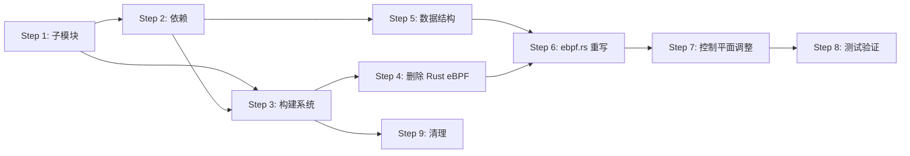

# dae-rs 迁移计划：从 aya-rs 迁移到 libbpf-rs

> **目标**：用 `libbpf-rs` 替代 `aya-rs` 管理 eBPF 程序，用 dae 的 C eBPF 模块（`tproxy.c`）替代现有的 Rust eBPF 代码

---

## 1. 整体架构

### 迁移前后对比

```
迁移前:
┌──────────────────────────────────────────────────┐
│                   dae-rs                         │
│  ┌────────────┐  ┌────────────────────────────┐  │
│  │ 控制面 Rust  │  │  ebpf/src/main.rs (Rust)   │  │
│  │ (aya API)   │  │  #![no_std] eBPF 内核程序   │  │
│  │  · load     │  │  aya-ebpf crate            │  │
│  │  · TC attach│  │  1595 行                   │  │
│  │  · Map I/O  │◀─┤  aya-ebpf macros           │  │
│  └──────┬──────┘  └────────────────────────────┘  │
│         │ aya 0.14                                 │
│         ▼                                          │
│  ┌──────────────────────────────┐                  │
│  │   ebpf.o (Rust→BPF 字节码)   │                  │
│  └──────────────────────────────┘                  │
└──────────────────────────────────────────────────┘

迁移后:
┌───────────────────────────────────────────────────────┐
│                     dae-rs                            │
│  ┌─────────────────┐   ┌───────────────────────────┐  │
│  │  控制面 Rust      │   │ dae/control/kern/ (子模块) │  │
│  │  (libbpf-rs API) │   │  tproxy.c (3178 行 C)    │  │
│  │   · OpenObject   │   │  ebpf_sync_defs.h        │  │
│  │   · TcHook       │──▶│  headers/(子模块)         │  │
│  │   · Map raw I/O  │   │   · vmlinux.h            │  │
│  └─────────────────┘   │   · bpf_helpers.h         │  │
│         │ libbpf-rs     │   · bpf_endian.h          │  │
│         ▼               └───────────────────────────┘  │
│  ┌──────────────────────────────┐                      │
│  │   tproxy.o (C→BPF 字节码)    │                      │
│  └──────────────────────────────┘                      │
└──────────────────────────────────────────────────────┘
```

### 迁移后的项目结构

```
dae-rs/
├── Cargo.toml                    # 修改: 删除 aya 依赖，添加 libbpf-rs
├── build.rs                      # 重写: 编译 C eBPF 代码
├── Makefile                      # 重写: clang 编译 C eBPF
├── rust-toolchain.toml           # 保留: stable (不再需要 nightly)
├── .gitignore                    # 修改: 添加 .o 文件忽略规则
├── .gitmodules                   # 新增: 添加 dae C eBPF 子模块
├── dae/                          # 新增(Git子模块): dae 项目根
│   └── control/kern/             # C eBPF 源码
│       ├── tproxy.c              # 核心 eBPF 程序
│       ├── ebpf_sync_defs.h      # 同步定义
│       ├── headers/              # 子模块: BPF 头文件
│       └── tests/                # eBPF 测试
│
├── control/                      # 修改: 控制面 crate
│   ├── Cargo.toml                # 修改: 删除 aya, 添加 libbpf-rs
│   └── src/
│       ├── ebpf.rs               # 重写: libbpf-rs API
│       ├── lib.rs                # 修改: 调整类型引用
│       ├── api.rs                # 不变
│       ├── config.rs             # 不变
│       ├── netns.rs              # 不变
│       └── tproxy.rs             # 不变
│
├── protocols/                    # 不变
├── shared/                       # 不变
├── src/                          # 不变 (main.rs, lib.rs)
│
└── ebpf/                         # 删除: 整个 Rust eBPF crate
    ├── Cargo.toml                # 删除
    └── src/main.rs               # 删除 (1595 行)
```

---

## 2. 文件变更清单

### 2.1 新增文件

| 文件 | 说明 |
|------|------|
| [`.gitmodules`](.gitmodules) | Git 子模块配置，引入 `dae` 和 `dae_bpf_headers` |
| [`dae/`](dae/) | Git 子模块指向 `https://github.com/daeuniverse/dae` |

### 2.2 删除文件

| 文件 | 说明 |
|------|------|
| [`ebpf/`](ebpf/) | 整个 Rust eBPF crate |
| [`ebpf/Cargo.toml`](ebpf/Cargo.toml) | Rust eBPF 依赖配置 |
| [`ebpf/src/main.rs`](ebpf/src/main.rs) | 1595 行 Rust eBPF 内核代码 |
| [`ebpf.o`](ebpf.o) | 预编译的 Rust eBPF 字节码（将由构建过程生成） |

### 2.3 修改文件

| 文件 | 变更类型 |
|------|----------|
| [`Cargo.toml`](Cargo.toml) | 删除 `aya` / `aya-log` 依赖 |
| [`control/Cargo.toml`](control/Cargo.toml) | 删除 `aya` / `aya-log`，添加 `libbpf-rs` / `libbpf-sys` |
| [`control/src/ebpf.rs`](control/src/ebpf.rs) | **完全重写**：aya API → libbpf-rs API |
| [`control/src/lib.rs`](control/src/lib.rs) | 轻微修改：调整数据结构引用、大小断言 |
| [`build.rs`](build.rs) | **完全重写**：编译 C eBPF 代码 |
| [`Makefile`](Makefile) | **完全重写**：clang 编译流程 |
| [`.gitignore`](.gitignore) | 添加 `*.o` 文件忽略规则 |
| [`rust-toolchain.toml`](rust-toolchain.toml) | 保留 `stable`（不再需要 nightly） |

### 2.4 不变文件

- [`src/main.rs`](src/main.rs) - 主入口不变
- [`src/lib.rs`](src/lib.rs) - 主库逻辑不变
- [`control/src/api.rs`](control/src/api.rs) - REST API 不变
- [`control/src/config.rs`](control/src/config.rs) - 配置解析不变
- [`control/src/netns.rs`](control/src/netns.rs) - 网络命名空间不变
- [`control/src/tproxy.rs`](control/src/tproxy.rs) - TProxy 监听器不变
- [`protocols/`](protocols/) - 协议 crate 不变
- [`shared/`](shared/) - 共享 crate 不变

---

## 3. 依赖变更

### 3.1 根 Cargo.toml

```toml
[workspace]
resolver = "2"
members = [
    "control",
    "protocols",
    "shared",
]
default-members = [
    ".",
    "control",
    "protocols",
    "shared",
]

[package]
name = "dae-rs"
version = "0.1.0"
edition = "2021"
description = "An eBPF-based proxy system - Rust rewrite of dae"

[dependencies]
# 删除: aya = "0.14"
# 删除: aya-log = "0.3"
tokio = { version = "1", features = ["full"] }
socket2 = "0.5"
nix = { version = "0.31", features = ["net", "feature", "sched", "user"] }
serde = { version = "1", features = ["derive"] }
serde_json = "1"
ipnet = "2"
thiserror = "2"
anyhow = "1"
tracing = "0.1"
tracing-subscriber = { version = "0.3", features = ["env-filter", "json"] }
clap = { version = "4", features = ["derive"] }
axum = "0.8"
uuid = { version = "1", features = ["v4"] }
tower-http = { version = "0.7", features = ["cors", "auth"] }
socks5-proto = "0.4"

# 添加: bytemuck - 用于安全地将 #[repr(C)] 结构体转换为字节切片
bytemuck = { version = "1", features = ["derive"] }

control = { path = "control" }
protocols = { path = "protocols" }
shared = { path = "shared" }

[profile.release]
strip = true
```

### 3.2 control/Cargo.toml

```toml
[package]
name = "control"
version = "0.1.0"
edition = "2021"

[dependencies]
# 删除: aya = "0.14"
# 删除: aya-log = "0.3"

# 添加: libbpf-rs (用户空间 eBPF 管理)
libbpf-rs = "0.24"
# 添加: libbpf-sys (libbpf C 库的 Rust 绑定)
libbpf-sys = "1.4"

# 添加: bytemuck - 结构体↔字节转换
bytemuck = { version = "1", features = ["derive"] }

tokio = { version = "1", features = ["full"] }
nix = { version = "0.31", features = ["net", "sched", "signal", "process"] }
serde = { version = "1", features = ["derive"] }
serde_json = "1"
thiserror = "2"
anyhow = "1"
tracing = "0.1"
socket2 = "0.5"
ipnet = "2"
libc = "0.2"
regex = "1"
axum = "0.8"
tower-http = { version = "0.7", features = ["cors", "auth", "trace"] }
chrono = "0.4"
shared = { path = "../shared" }
protocols = { path = "../protocols" }

[build-dependencies]
# 添加: libbpf-cargo - 用于编译 C eBPF 代码并生成骨架
libbpf-cargo = "0.24"

[dev-dependencies]
tower = "0.5"
```

### 3.3 关键依赖说明

| 依赖 | 版本 | 来源 | 用途 |
|------|------|------|------|
| `libbpf-rs` | 0.24 | crates.io | Rust 安全绑定，加载/管理 eBPF 对象、Map 操作、TC 附加 |
| `libbpf-sys` | 1.4 | crates.io | libbpf C 库的原始 FFI 绑定（libbpf-rs 的底层依赖） |
| `libbpf-cargo` | 0.24 | crates.io | 构建依赖，用于编译 C eBPF 代码（替代 clang 命令行） |
| `bytemuck` | 1.x | crates.io | `#[repr(C)]` 结构体与 `&[u8]` 之间的安全零拷贝转换 |

---

## 4. Git 子模块配置

### 4.1 `.gitmodules`

```ini
[submodule "dae"]
    path = dae
    url = https://github.com/daeuniverse/dae
    # 可选的: branch = main 或特定标签
[submodule "dae/control/kern/headers"]
    path = dae/control/kern/headers
    url = https://github.com/daeuniverse/dae_bpf_headers
```

### 4.2 初始化命令

```bash
# 初始化主子模块
git submodule add https://github.com/daeuniverse/dae dae

# 初始化 BPF headers 子模块（dae 项目本身已有此子模块配置）
git submodule update --init --recursive dae/control/kern/headers
```

### 4.3 子模块内容

`dae/control/kern/` 目录结构（子模块 checkout 后）：

```
dae/control/kern/
├── tproxy.c                # 3178 行 - 核心 eBPF TC/CGroup 程序
├── ebpf_sync_defs.h        # 43 行 - Go↔C 同步定义
├── tests/                  # eBPF 测试
│   ├── bpf_test.c
│   ├── bpf_test.go
│   ├── bpf_test.h
│   └── bpf_test_helpers_test.go
└── headers/                # 子模块: BPF 头文件
    ├── vmlinux.h
    ├── bpf_helpers.h
    ├── bpf_endian.h
    ├── bpf_core_read.h
    ├── errno-base.h
    ├── if_ether_defs.h
    ├── pkt_cls_defs.h
    ├── socket_defs.h
    └── upai_in6_defs.h
```

---

## 5. Makefile 重写

### 5.1 新的 Makefile

```makefile
.PHONY: all build ebpf release clean run submodule

CLANG ?= clang
LLVM_STRIP ?= llvm-strip
CFLAGS := -O2 -Wall -Werror -target bpf -g $(CFLAGS)
MAX_MATCH_SET_LEN ?= 1024
CFLAGS := -DMAX_MATCH_SET_LEN=$(MAX_MATCH_SET_LEN) $(CFLAGS)

# eBPF C 源码路径
EBPF_KERN_DIR := dae/control/kern
EBPF_HEADERS := $(EBPF_KERN_DIR)/headers

all: build

# 初始化子模块
submodule:
	git submodule update --init --recursive

# 编译 eBPF C 代码 → ebpf.o
ebpf: submodule
	$(CLANG) $(CFLAGS) \
		-I $(EBPF_HEADERS) \
		-I $(EBPF_KERN_DIR) \
		-c $(EBPF_KERN_DIR)/tproxy.c \
		-o ebpf.o
	$(LLVM_STRIP) -g ebpf.o

# 编译主程序（build.rs 会嵌入 ebpf.o）
build: ebpf
	cargo build

release: ebpf
	cargo build --release

clean:
	cargo clean
	rm -f ebpf.o

run: build
	cargo run -- $(ARGS)
```

### 5.2 关键说明

1. **CLANG 要求**：需要 `clang` ≥ 14 和 `llvm-strip`，推荐 clang-18+
2. **BPF 目标**：`-target bpf` 生成 BPF 字节码
3. **CO-RE 支持**：`-g` 保留 BTF 信息，用于 BTF 的 CO-RE 功能
4. **头文件路径**：`-I $(EBPF_HEADERS)` 指向 dae_bpf_headers 子模块
5. **MAX_MATCH_SET_LEN**：可在命令行覆盖（`make MAX_MATCH_SET_LEN=2048`）

---

## 6. build.rs 重写

### 6.1 新的 build.rs

```rust
use std::env;
use std::path::PathBuf;
use std::process::Command;

fn main() {
    // 告诉 cargo 在 tproxy.c 或头文件变更时重新运行
    println!("cargo:rerun-if-changed=dae/control/kern/tproxy.c");
    println!("cargo:rerun-if-changed=dae/control/kern/ebpf_sync_defs.h");
    println!("cargo:rerun-if-changed=dae/control/kern/headers");

    let out_dir = PathBuf::from(env::var("OUT_DIR").unwrap());
    let manifest_dir = PathBuf::from(env::var("CARGO_MANIFEST_DIR").unwrap());

    // eBPF 源码路径
    let kern_dir = manifest_dir.join("dae/control/kern");
    let headers_dir = kern_dir.join("headers");
    let tproxy_c = kern_dir.join("tproxy.c");
    let output_obj = out_dir.join("ebpf.o");

    // 检查 tproxy.c 是否存在
    assert!(
        tproxy_c.exists(),
        "tproxy.c not found at {}. Run `git submodule update --init --recursive` first.",
        tproxy_c.display()
    );

    // 从环境变量或默认值获取 clang
    let clang = env::var("CLANG").unwrap_or_else(|_| "clang".to_string());
    let llvm_strip = env::var("LLVM_STRIP").unwrap_or_else(|_| "llvm-strip".to_string());
    let max_match_set_len = env::var("MAX_MATCH_SET_LEN").unwrap_or_else(|_| "1024".to_string());

    // 编译 tproxy.c → ebpf.o
    let status = Command::new(&clang)
        .args([
            "-O2",
            "-Wall",
            "-Werror",
            "-target",
            "bpf",
            "-g",
            &format!("-DMAX_MATCH_SET_LEN={}", max_match_set_len),
            "-I",
            headers_dir.to_str().unwrap(),
            "-I",
            kern_dir.to_str().unwrap(),
            "-c",
            tproxy_c.to_str().unwrap(),
            "-o",
            output_obj.to_str().unwrap(),
        ])
        .status()
        .expect("Failed to execute clang for eBPF compilation");

    assert!(
        status.success(),
        "clang eBPF compilation failed. Ensure clang is installed."
    );

    // Strip debug info from .o file (reduces size, BTF stays)
    let strip_status = Command::new(&llvm_strip)
        .args(["-g", output_obj.to_str().unwrap()])
        .status();

    if let Ok(status) = strip_status {
        if status.success() {
            println!("cargo:warning=eBPF bytecode stripped");
        }
    }

    println!(
        "cargo:warning=eBPF bytecode compiled from tproxy.c -> {}",
        output_obj.display()
    );
}
```

### 6.2 与旧 build.rs 的对比

| 旧 build.rs | 新 build.rs |
|-------------|-------------|
| 仅复制预编译的 `ebpf.o` | 使用 clang 从源码编译 `tproxy.c` |
| 依赖 `make ebpf` 前置步骤 | 自包含，自动编译 |
| 检查 `ebpf.o` 是否存在 | 检查 `tproxy.c` 是否存在 |
| 无 clang 调用 | 调用 clang + llvm-strip |
| 无子模块检查 | 有子模块存在性断言 |

---

## 7. ebpf.rs 重写策略

### 7.1 核心 API 映射

| aya API | libbpf-rs API | 说明 |
|---------|---------------|------|
| `Ebpf::load_file(path)` | `OpenObject::from_file(path)?.load()?` | 加载 eBPF 对象文件 |
| `Ebpf::load(bytes)` | `OpenObject::from_memory(bytes)?.load()?` | 从内存加载 |
| `SchedClassifier::try_from(p)` | `obj.prog_mut("name")?` | 获取程序 |
| `.load()` → `.attach(iface, type)` | `TcHook::new(prog).set_ifindex(n).set_attach_point(p).attach()?` | TC 附加 |
| `SchedClassifierLink` (take_link) | `TcHook::attach()` 返回 `Link` | 链接生命周期管理 |
| `qdisc_add_clsact(iface)` | libbpf-rs 无内置 API → 通过 netlink 或 `tc` 命令 | 添加 clsact qdisc |
| `Array::try_from(map)` | `map.update(&key_bytes, &val_bytes, flags)` | Array Map 操作 |
| `HashMap::try_from(map)` | `map.lookup(&key_bytes, flags)` | HashMap Map 操作 |
| `unsafe impl Pod` | `bytemuck::cast_slice` / `bytemuck::pod_read_unaligned` | 字节↔结构体转换 |
| Map `get(&key, flags)` | `map.lookup(&key_bytes, flags)` | 读取 Map 条目 |
| Map `set(key, val, flags)` | `map.update(&key_bytes, &val_bytes, flags)` | 写入 Map 条目 |
| Map `insert(key, val, flags)` | `map.update(&key_bytes, &val_bytes, flags)` | HashMap 插入 |
| Map `remove(key)` | `map.delete(&key_bytes)` | HashMap 删除 |
| `unsafe impl Pod for T` | 不需要，直接使用 `bytemuck` | 数据结构 |

### 7.2 新的 EbpfManager 结构

```rust
use libbpf_rs::{Object, OpenObject, TcHook};
use libbpf_rs::tc_hook::{TcAttachPoint};
use std::path::Path;

pub struct EbpfManager {
    obj: Option<Object>,
    links: Vec<libbpf_rs::Link>,
    iface: String,
    bpf_path: String,
}
```

### 7.3 数据结构的迁移

**所有 `unsafe impl aya::Pod for T` 都需要移除，改用 `bytemuck` 的 `Pod` trait：**

```rust
// 旧（aya）:
#[repr(C)]
#[derive(Debug, Clone, Copy)]
pub struct RuleEntry { ... }
unsafe impl aya::Pod for RuleEntry {}

// 新（libbpf-rs）:
#[repr(C)]
#[derive(Debug, Clone, Copy, bytemuck::Pod, bytemuck::Zeroable)]
pub struct RuleEntry { ... }
```

涉及的 9 个数据结构：
1. [`RuleEntry`](control/src/ebpf.rs:56) - 添加 `bytemuck::Pod, bytemuck::Zeroable` derive
2. [`TuplesKey`](control/src/ebpf.rs:83) - 同上
3. [`RoutingMeta`](control/src/ebpf.rs:155) - 同上（删除 unused impl for aya::Pod）
4. [`ConnState`](control/src/ebpf.rs:168) - 同上（注意 `bool` 字段，bytemuck 需要 `Zeroable`）
5. [`ProcInfo`](control/src/ebpf.rs:186) - 同上
6. [`LpmKey`](control/src/ebpf.rs:212) - 同上
7. [`MatchSetValue`](control/src/ebpf.rs:230) - 同上（union 类型需特殊处理）
8. [`CidrEntry`](control/src/ebpf.rs:245) - 同上
9. [`MatchSet`](control/src/ebpf.rs:264) - 同上

> **注意**：`MatchSetValue` 是 `union` 类型，bytemuck 的 `Pod`/`Zeroable` 可以 derive，但 `Clone` 需要手动实现（已在代码中）。

### 7.4 加载流程对比

```rust
// ── 旧 (aya) ──
let ebpf = Ebpf::load_file(path)?;

// 设置全局变量 (aya 无直接 API)
// ... 需要手动修改 Map

let ingress: &mut SchedClassifier = ebpf
    .program_mut("tc_ingress")?
    .try_into()?;
ingress.load()?;
let link_id = ingress.attach(iface, TcAttachType::Ingress)?;
let link = ingress.take_link(link_id)?;


// ── 新 (libbpf-rs) ──
let open_obj = OpenObject::from_file(path)?;

// 设置全局变量 (PARAM 结构体)
let param = Daeparam { ... };
open_obj.set_var("PARAM", bytemuck::bytes_of(&param))?;

let mut obj = open_obj.load()?;

// TC 附加
let prog = obj.prog_mut("tc_ingress")?;
let mut hook = TcHook::new(prog)?;
hook.set_ifindex(ifindex)?
    .set_attach_point(TcAttachPoint::Ingress)?
    .attach()?;
```

### 7.5 Map 操作对比

```rust
// ── 旧 (aya) - Map 写入 ──
let map = ebpf.map_mut("RULES_MAP").ok_or(...)?;
let mut array = Array::<&mut MapData, RuleEntry>::try_from(map)?;
array.set(0, *rule, 0)?;

// ── 新 (libbpf-rs) - Map 写入 ──
let map = obj.map_mut("RULES_MAP")?;
let key = 0u32.to_ne_bytes();
let value = bytemuck::bytes_of(rule);
map.update(&key, value, 0)?;
```

```rust
// ── 旧 (aya) - HashMap 读取 ──
let map = ebpf.map_mut("CONNTRACK_MAP").ok_or(...)?;
let hmap = HashMap::<&mut MapData, TuplesKey, ConnState>::try_from(map)?;
let state = hmap.get(&key, 0)?;

// ── 新 (libbpf-rs) - HashMap 读取 ──
let map = obj.map_mut("CONNTRACK_MAP")?;
let key_bytes = bytemuck::bytes_of(&key);
if let Some(value_bytes) = map.lookup(&key_bytes, 0)? {
    let state: ConnState = bytemuck::pod_read_unaligned(&value_bytes);
    Ok(Some(state))
} else {
    Ok(None)
}
```

### 7.6 TC qdisc 处理

libbpf-rs 的 `TcHook` 不会自动添加 clsact qdisc。需要手动处理：

**方案 A**（推荐）：使用 `tc` 命令

```rust
fn ensure_clsact(iface: &str) -> Result<()> {
    let output = std::process::Command::new("tc")
        .args(["qdisc", "show", "dev", iface, "clsact"])
        .output()?;

    if !output.status.success() {
        // clsact 不存在，添加它
        std::process::Command::new("tc")
            .args(["qdisc", "add", "dev", iface, "clsact"])
            .status()?;
    }
    Ok(())
}
```

**方案 B**：使用 netlink（通过 `neli` 或 `rtnetlink` crate）

推荐方案 A 保持简单。aya 的 `qdisc_add_clsact` 本质上也做同样的事情。

### 7.7 tproxy.c 的 eBPF 程序 SEC 名称

tproxy.c 中定义了多个 SEC 段。需要从 tproxy.c 中 grep 出 `SEC(` 来确认所有程序名称：

```c
// 关键程序段（需要确定确切的 SEC 名称）
SEC("tc_ingress")    // 或类似名称 - TC ingress hook
SEC("tc_egress")     // 或类似名称 - TC egress hook
```

> **注意**：由于 `tproxy.c` 有 3178 行，实际 SEC 名称需要通过分析源码确认。libbpf-rs 通过 `obj.prog_mut("name")` 按程序名称查找，名称需匹配 SEC 标签或函数名。

### 7.8 tproxy.c 的 Map 名称映射

tproxy.c 中定义的 BPF maps 及其 libbpf-rs 访问方式：

| C Map 变量名 | BPF Map 类型 | libbpf-rs 访问 | 用途 |
|-------------|-------------|----------------|------|
| `conn_state_map` | `BPF_MAP_TYPE_HASH` | `obj.map_mut("conn_state_map")` | 连接跟踪状态 |
| `routing_map` | `BPF_MAP_TYPE_ARRAY` | `obj.map_mut("routing_map")` | 路由规则 |
| `routing_meta_map` | `BPF_MAP_TYPE_ARRAY` | `obj.map_mut("routing_meta_map")` | 路由元数据 |
| `bpf_stats_map` | `BPF_MAP_TYPE_ARRAY` | `obj.map_mut("bpf_stats_map")` | 统计数据 |
| `event_ringbuf` | `BPF_MAP_TYPE_RINGBUF` | `obj.map_mut("event_ringbuf")` | 事件 ring buffer |
| `lpm_array_map` | `BPF_MAP_TYPE_ARRAY_OF_MAPS` | `obj.map_mut("lpm_array_map")` | LPM trie 数组 |
| `redirect_track` | `BPF_MAP_TYPE_HASH` | `obj.map_mut("redirect_track")` | 重定向追踪 |
| `cookie_pid_map` | `BPF_MAP_TYPE_HASH` | `obj.map_mut("cookie_pid_map")` | 进程名/PID 映射 |
| `outbound_connectivity_map` | `BPF_MAP_TYPE_ARRAY` | `obj.map_mut("outbound_connectivity_map")` | 出站连通性 |
| `domain_routing_map` | `BPF_MAP_TYPE_HASH` | `obj.map_mut("domain_routing_map")` | 域名路由缓存 |
| `parse_ctx_scratch_map` | `BPF_MAP_TYPE_PERCPU_ARRAY` | 通常用户空间不直接访问 | 解析上下文 |
| `listen_socket_map` | `BPF_MAP_TYPE_SOCKMAP` | `obj.map_mut("listen_socket_map")` | 监听 socket |
| `routing_handoff_map` | `BPF_MAP_TYPE_HASH` | `obj.map_mut("routing_handoff_map")` | 路由交接 |
| `fast_sock` | `BPF_MAP_TYPE_SOCKHASH` | `obj.map_mut("fast_sock")` | SOCKHASH (存根) |

### 7.9 全局变量 PARAM 的处理

tproxy.c 使用 `const volatile struct dae_param PARAM` 作为全局配置。libbpf-rs 通过 `set_var` 在加载前设置：

```rust
#[repr(C)]
#[derive(Debug, Clone, Copy, bytemuck::Pod, bytemuck::Zeroable)]
pub struct Daeparam {
    pub tproxy_port: u32,
    pub control_plane_pid: u32,
    pub dae0_ifindex: u32,
    pub dae_netns_id: u32,
    pub dae0peer_mac: [u8; 6],
    pub padding_after_mac: [u8; 2],
    pub use_redirect_peer: u8,
    pub has_bpf_get_current_task: u8,
    pub padding2: u16,
    pub dae_socket_mark: u32,
}

// 设置方式
let open_obj = OpenObject::from_file(path)?;
let param = Daeparam { ... };
open_obj.set_var("PARAM", bytemuck::bytes_of(&param))?;
let mut obj = open_obj.load()?;
```

### 7.10 RingBuffer 事件处理

tproxy.c 使用 `event_ringbuf`（`BPF_MAP_TYPE_RINGBUF`）发送事件到用户空间。libbpf-rs 支持 RingBuffer：

```rust
use libbpf_rs::RingBufferBuilder;

let ringbuf_map = obj.map("event_ringbuf")?;
let mut builder = RingBufferBuilder::new();
builder.add(ringbuf_map, |data: &[u8]| -> i32 {
    // 处理 dae_event
    let event: Daeevent = bytemuck::pod_read_unaligned(data);
    // ...
    0  // 返回 0 表示成功
})?;
let ringbuf = builder.build()?;

// 在循环中轮询
ringbuf.poll(std::time::Duration::from_millis(100))?;
```

---

## 8. Rust eBPF 代码处理

### 8.1 完整删除

整个 [`ebpf/`](ebpf/) 目录将被删除，包括：

| 文件 | 行数 | 说明 |
|------|------|------|
| `ebpf/Cargo.toml` | 22 | 依赖 `aya-ebpf`, `aya-log-ebpf` |
| `ebpf/src/main.rs` | 1595 | Rust eBPF 内核代码 |

### 8.2 删除原因

1. **目标一致**：新目标是使用 dae 的 C eBPF（`tproxy.c`），它更成熟、经过生产验证
2. **避免重复维护**：两个独立的 eBPF 实现会导致功能分歧
3. **利用 ekaf 生态**：libbpf + CO-RE 提供更好的内核兼容性
4. **功能完整性**：`tproxy.c` 实现了完整的连接跟踪、路由、LPM trie、DNS 等 dae 核心功能

### 8.3 功能覆盖对照

| 功能 | Rust eBPF | C tproxy.c | 迁移后 |
|------|-----------|------------|--------|
| TC ingress/egress | ✅ | ✅ | ✅ (C) |
| 5-tuple conntrack | ✅ | ✅ | ✅ (C) |
| TCP state machine | ✅ | ✅ | ✅ (C) |
| 路由规则匹配 | ✅ | ✅ | ✅ (C) |
| 进程排除 | ✅ | ✅ | ✅ (C) |
| CIDR LPM trie | ❌ | ✅ | ✅ (C, 新增) |
| 域名路由 | ❌ | ✅ | ✅ (C, 新增) |
| 事件 RingBuffer | ❌ | ✅ | ✅ (C, 新增) |
| SOCKMAP redirect | ❌ | ✅ | ✅ (C, 新增) |
| 多 outbound 组 | ❌ | ✅ | ✅ (C, 新增) |
| MAC 重定向 | ❌ | ✅ | ✅ (C, 新增) |
| CO-RE 兼容 | ❌ (无) | ✅ (BTF) | ✅ (C) |

---

## 9. 构建流程

### 9.1 完整构建步骤

```
1. 初始化子模块
   └─ git submodule update --init --recursive
       ├─ dae/                          → dae 项目仓库
       └─ dae/control/kern/headers/     → dae_bpf_headers

2. 编译 C eBPF 代码
   ├─ clang -O2 -target bpf -g tproxy.c → ebpf.o
   ├─ llvm-strip -g ebpf.o              → 剥离调试符号
   └─ cp ebpf.o OUT_DIR/

3. 编译 Rust 用户空间代码
   ├─ build.rs: 嵌入 ebpf.o
   └─ cargo build
       ├─ libbpf-rs: 加载 ebpf.o
       ├─ libbpf-sys: libbpf C 库
       └─ 控制平面: TC 附加、Map I/O
```

### 9.2 构建系统依赖

| 工具 | 用途 | 安装方式 |
|------|------|----------|
| `clang` (≥14) | 编译 C eBPF 为 BPF 字节码 | `apt install clang llvm` |
| `llvm-strip` | 剥离 .o 文件的符号 | `apt install llvm` |
| `libbpf-dev` | libbpf C 库开发头文件 | `apt install libbpf-dev` |
| libc 6 开发环境 | libbpf-sys 依赖 | `apt install libc6-dev` |
| `pkg-config` | 查找 libbpf 库路径 | `apt install pkg-config` |

### 9.3 Makefile 目标

| 目标 | 说明 |
|------|------|
| `make submodule` | 初始化 Git 子模块 |
| `make ebpf` | 编译 C eBPF → `ebpf.o` |
| `make build` | ebpf + cargo build |
| `make release` | ebpf + cargo build --release |
| `make clean` | 清理构建产物 |
| `make run` | build + cargo run |

### 9.4 Cargo 构建脚本流程

```
cargo build
  └─ build.rs 运行（编译时）
      ├─ 检查 git submodule 是否初始化
      ├─ 查找 CLANG 环境变量（或使用默认 clang）
      ├─ 执行 clang 编译 tproxy.c → ebpf.o
      ├─ 执行 llvm-strip 剥离符号
      └─ ebpf.o 复制到 OUT_DIR/

  └─ rustc 编译（编译时）
      ├─ src/main.rs 中使用：
      │   include_bytes!(concat!(env!("OUT_DIR"), "/ebpf.o"))
      └─ control crate 中使用 libbpf-rs API

  └─ 运行时
      ├─ libbpf-rs 从嵌入的字节码加载 eBPF
      ├─ 设置 PARAM 全局变量
      ├─ 附加 TC ingress/egress 程序
      └─ 开始 Map 读写和事件处理
```

---

## 10. 实施顺序

### 10.1 实施步骤（按依赖关系排序）

```
Step 1: 子模块配置
  依赖: 无
  文件: .gitmodules
  说明: 添加 dae 和 dae_bpf_headers 子模块

Step 2: 依赖更新
  依赖: Step 1
  文件: Cargo.toml, control/Cargo.toml
  说明: 删除 aya, 添加 libbpf-rs, libbpf-sys, libbpf-cargo, bytemuck

Step 3: 构建系统重写
  依赖: Step 1, Step 2
  文件: Makefile, build.rs, .gitignore
  说明: 重写编译流程，支持 clang 编译 C eBPF

Step 4: 删除 Rust eBPF crate
  依赖: Step 3 (确保新构建系统就绪)
  文件: ebpf/ 目录完全删除
  说明: 删除 ebpf/Cargo.toml, ebpf/src/main.rs

Step 5: 数据结构迁移
  依赖: Step 2 (bytemuck 可用)
  文件: control/src/ebpf.rs (数据结构部分)
  说明: 替换 aya::Pod → bytemuck::Pod, 添加 Daeparam 结构体

Step 6: ebpf.rs 核心重写
  依赖: Step 5
  文件: control/src/ebpf.rs (EbpfManager + 方法)
  说明: 用 libbpf-rs API 重写加载/TC 附加/Map 操作

Step 7: 控制平面调整
  依赖: Step 6
  文件: control/src/lib.rs
  说明: 调整对 ebpf.rs 的调用接口、更新测试断言

Step 8: 集成测试与验证
  依赖: Step 7
  说明: 编译测试、功能验证、回归测试

Step 9: 清理
  依赖: Step 3 (确保清理也更新)
  文件: ebpf.o (根目录), Makefile clean 目标
  说明: 更新 clean 目标、更新 .gitignore
```

### 10.2 依赖关系图



### 10.3 实施建议

1. **Step 1-3 可并行执行**（子模块 + 依赖 + 构建系统无交叉依赖）
2. **Step 5-6 是核心工作**，需要仔细处理 API 映射
3. **建议在 Step 6 后立即编译测试**，确保基础功能正常
4. **Step 8 应包括**：
   - `cargo build` 正常编译
   - `cargo test` 通过所有单元测试
   - `make ebpf` 成功生成 ebpf.o
   - `make run` 能正常启动（需 root 权限）

---

## 附录 A: 关键代码片段参考

### A.1 libbpf-rs 完整加载流程

```rust
use libbpf_rs::{OpenObject, Object, TcHook};
use libbpf_rs::tc_hook::TcAttachPoint;
use libbpf_rs::RingBufferBuilder;

pub fn load_and_attach(bpf_bytes: &[u8], ifindex: u32, param: &Daeparam) -> Result<(Object, Vec<libbpf_rs::Link>)> {
    // 1. 从内存打开
    let open_obj = OpenObject::from_memory(bpf_bytes)?;

    // 2. 设置全局变量 PARAM
    open_obj.set_var("PARAM", bytemuck::bytes_of(param))?;

    // 3. 加载到内核
    let mut obj = open_obj.load()?;

    // 4. 确保 clsact qdisc 存在
    ensure_clsact(ifindex)?;

    // 5. TC 附加 ingress
    let mut links = Vec::new();
    let prog = obj.prog_mut("tc_ingress")?;
    let mut hook = TcHook::new(prog)?;
    hook.set_ifindex(ifindex)?
        .set_attach_point(TcAttachPoint::Ingress)?
        .set_hook_name("dae_ingress")?;
    let link = hook.attach()?;
    links.push(link);

    // 6. TC 附加 egress
    let prog = obj.prog_mut("tc_egress")?;
    let mut hook = TcHook::new(prog)?;
    hook.set_ifindex(ifindex)?
        .set_attach_point(TcAttachPoint::Egress)?
        .set_hook_name("dae_egress")?;
    let link = hook.attach()?;
    links.push(link);

    Ok((obj, links))
}
```

### A.2 RingBuffer 事件处理

```rust
pub fn setup_ringbuffer(obj: &Object) -> Result<impl FnMut()> {
    let ringbuf_map = obj.map("event_ringbuf")?;
    let mut builder = RingBufferBuilder::new();
    builder.add(ringbuf_map, |data: &[u8]| -> i32 {
        // dae_event 结构体定义
        let event: Daeevent = bytemuck::pod_read_unaligned(data);
        match event.type_ {
            0 => tracing::warn!("Blocked: ..."),
            1 => tracing::warn!("UDP overflow"),
            2 => tracing::warn!("TCP overflow"),
            _ => {}
        }
        0
    })?;
    let ringbuf = builder.build()?;

    move || {
        ringbuf.poll(std::time::Duration::from_millis(100)).ok();
    }
}
```

### A.3 获取网络接口 ifindex

libbpf-rs 的 `TcHook::set_ifindex` 接受 `u32` 类型的 ifindex，需要从接口名获取：

```rust
pub fn if_nametoindex(ifname: &str) -> Result<u32> {
    let cstr = std::ffi::CString::new(ifname)?;
    let ifindex = unsafe { libc::if_nametoindex(cstr.as_ptr()) };
    if ifindex == 0 {
        anyhow::bail!("Interface {} not found", ifname);
    }
    Ok(ifindex)
}
```

### A.4 完整的新 EbpfManager 方法签名参考

```rust
impl EbpfManager {
    pub fn new(iface: &str) -> Self;
    pub fn new_with_path(iface: &str, bpf_path: &str) -> Self;
    pub fn load(&mut self) -> Result<()>;
    pub fn load_from_bytes(&mut self, bytes: &[u8]) -> Result<()>;
    pub fn attach_tc(&mut self) -> Result<()>;
    pub fn detach_tc(&mut self) -> Result<()>;
    pub fn unload(&mut self) -> Result<()>;
    pub fn set_param(&mut self, param: &Daeparam) -> Result<()>;
    
    // Map 操作
    pub fn write_rules(&mut self, rules: &[RuleEntry]) -> Result<()>;
    pub fn write_excluded_comm(&mut self, comm_hashes: &[u32]) -> Result<()>;
    pub fn write_excluded_pids(&mut self, pids: &[u32]) -> Result<()>;
    pub fn read_stats(&mut self) -> Result<[u64; 16]>;
    pub fn read_conntrack(&mut self, key: &TuplesKey) -> Result<Option<ConnState>>;
    pub fn delete_conntrack(&mut self, key: &TuplesKey) -> Result<()>;
    pub fn write_routing_rules(&mut self, match_sets: &[MatchSet]) -> Result<()>;
    pub fn write_cidr_table(&mut self, entries: &[(u32, CidrEntry)]) -> Result<()>;
    
    // RingBuffer 事件处理
    pub fn poll_events(&mut self, timeout_ms: u64) -> Result<()>;
    
    // 状态查询
    pub fn is_loaded(&self) -> bool;
    pub fn is_attached(&self) -> bool;
    pub fn iface(&self) -> &str;
    pub fn link_count(&self) -> usize;
}
```

## 附录 B: 常见问题

### B.1 libbpf 版本要求

- `libbpf-rs` 0.24 需要 `libbpf-sys` 1.4（绑定 libbpf 1.4.x）
- 系统需要安装 `libbpf-dev` ≥ 1.4
- Ubuntu 24.04 及以上包含所需版本

### B.2 clang 版本要求

- clang 14+ 支持 `-target bpf`
- clang 18+ 推荐用于更好的 BPF 代码生成
- 某些旧版本可能有 BPF 内联汇编问题

### B.3 CO-RE 支持

- tproxy.c 定义了 `BPF_NO_PRESERVE_ACCESS_INDEX` 来禁用隐式 CO-RE
- 但仍需要 BTF（`-g` 编译标志）用于最佳兼容性
- libbpf 会自动处理 BTF 加载

### B.4 权限要求

与迁移前相同：
- `CAP_BPF` / `CAP_NET_ADMIN` / `CAP_SYS_ADMIN`
- 需要 root 权限运行

---

> **文档版本**: v1.0
> **创建日期**: 2026-07-24
> **适用项目**: dae-rs (https://github.com/daeuniverse/dae)
